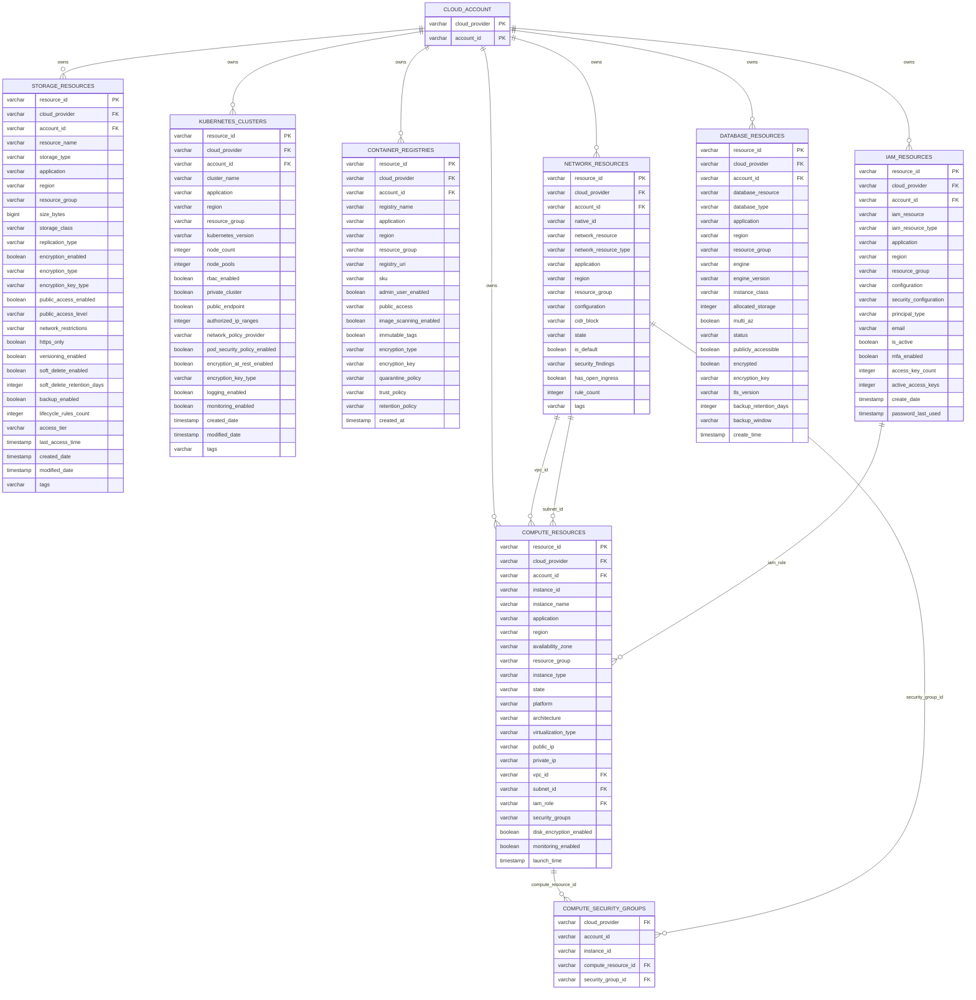

# Cloud Ops Adapter — Configuration & Schema Reference

The Cloud Ops adapter exposes a read-only SQL view of cloud resource inventory across **Azure, AWS
and GCP**. One connection unifies all configured providers: every table queries each provider in
parallel and `UNION`s the rows, discriminated by the `cloud_provider` column.

This document covers how to configure an instance and gives the complete schema — every table, its
attributes, and the (logical) primary/foreign keys — plus an ERD.

---

## 1. Configuring an instance

The adapter is reachable three ways. All three resolve to the same `CloudOpsSchemaFactory` and the
same `cloud` schema; they differ only in how you pass configuration.

### a. Directly via the Calcite JDBC driver

Driver class `org.apache.calcite.adapter.ops.CloudOpsDriver`, URL prefix `jdbc:cloudops:`. Parameters
are `;`-delimited `key=value` pairs using the **flat dotted** operand keys:

```
jdbc:cloudops:aws.accessKeyId=AKIA...;aws.secretAccessKey=...;aws.region=us-east-1;aws.accountIds=111111111111,222222222222
```

### b. Via a Calcite model file

```json
{
  "version": "1.0",
  "defaultSchema": "cloud",
  "schemas": [
    {
      "name": "cloud",
      "type": "custom",
      "factory": "org.apache.calcite.adapter.ops.CloudOpsSchemaFactory",
      "operand": {
        "aws.accessKeyId": "AKIA...",
        "aws.secretAccessKey": "...",
        "aws.region": "us-east-1",
        "aws.accountIds": "111111111111,222222222222",
        "azure.tenantId": "...",
        "azure.clientId": "...",
        "azure.clientSecret": "...",
        "azure.subscriptionIds": "sub-1,sub-2"
      }
    }
  ]
}
```

Connect with `jdbc:calcite:model=/path/to/model.json`.

### c. Via the Trino connector

Use the [`trino-cloudops`](../../trino-cloudops/README.md) plugin (`connector.name=cloudops`), which
maps friendly catalog properties (`aws.access-key-id`, …) onto a `jdbc:cloudops:` URL for you.

### Configuration parameters

Keys below are the operand / JDBC-URL form. (The Trino connector uses the dashed equivalents, e.g.
`aws.access-key-id`.) List values are comma-separated. Each provider also falls back to the listed
environment variable when its operand is absent.

**Azure** — enabled when `azure.tenantId` is present.

| Key | Required (when enabled) | Env fallback | Description |
|-----|-------------------------|--------------|-------------|
| `azure.tenantId` | gating | `AZURE_TENANT_ID` | Azure AD tenant ID |
| `azure.clientId` | yes | `AZURE_CLIENT_ID` | Service-principal client ID |
| `azure.clientSecret` | yes | `AZURE_CLIENT_SECRET` | Service-principal secret |
| `azure.subscriptionIds` | yes | `AZURE_SUBSCRIPTION_IDS` | Subscriptions to inventory |

**AWS** — enabled when `aws.accessKeyId` is present.

| Key | Required (when enabled) | Env fallback | Description |
|-----|-------------------------|--------------|-------------|
| `aws.accessKeyId` | gating | `AWS_ACCESS_KEY_ID` | Access key ID |
| `aws.secretAccessKey` | yes | `AWS_SECRET_ACCESS_KEY` | Secret access key |
| `aws.region` | yes | `AWS_REGION` | Region, e.g. `us-east-1` |
| `aws.accountIds` | yes | `AWS_ACCOUNT_IDS` | Account IDs to inventory |
| `aws.roleArn` | no | `AWS_ROLE_ARN` | Role ARN to assume (cross-account) |

**GCP** — enabled when `gcp.credentialsPath` is present.

| Key | Required (when enabled) | Env fallback | Description |
|-----|-------------------------|--------------|-------------|
| `gcp.credentialsPath` | gating | `GCP_CREDENTIALS_PATH` | Path to service-account JSON key |
| `gcp.projectIds` | yes | `GCP_PROJECT_IDS` | Projects to inventory |

**General / cache**

| Key | Default | Env fallback | Description |
|-----|---------|--------------|-------------|
| `providers` | all configured | `CLOUD_OPS_PROVIDERS` | Subset to query, e.g. `aws,azure` |
| `cache.enabled` | `true` | `CLOUD_OPS_CACHE_ENABLED` | Enable the result cache |
| `cache.ttlMinutes` | `5` | `CLOUD_OPS_CACHE_TTL_MINUTES` | Cache TTL (minutes) |
| `cache.debugMode` | `false` | `CLOUD_OPS_CACHE_DEBUG_MODE` | Cache debug logging |

At least one provider must be configured, or schema creation fails with
`At least one cloud provider must be configured`. (The `trino-cloudops` connector additionally
fails fast on a *partially* configured provider.)

---

## 2. Schema overview

The default schema is **`cloud`**, containing seven resource tables. Two metadata schemas —
`information_schema` and `pg_catalog` — are also registered at the root for catalog introspection.

| Table | Resource kind | Azure | AWS | GCP |
|-------|---------------|:-----:|:---:|:---:|
| `compute_resources` | Virtual machines / instances | ✓ | ✓ | ✓ |
| `storage_resources` | Object/blob storage, accounts | ✓ | ✓ | ✓ |
| `kubernetes_clusters` | AKS / EKS / GKE | ✓ | ✓ | ✓ |
| `container_registries` | ACR / ECR / Artifact Registry | ✓ | ✓ | ✓ |
| `network_resources` | VNets/VPCs, subnets, security groups | ✓ | ✓ | ✓ |
| `iam_resources` | Users, roles, service accounts | ✓ | ✓ | ✓ |
| `database_resources` | Managed databases | ✓ | ✓ | ✓ |

All tables are read-only and support projection, filter, sort, and pagination pushdown. Pushing a
predicate on `cloud_provider` or `account_id` restricts which providers/accounts are queried.

---

## 3. Keys & relationships

> **Constraints are declared as unenforced planner hints.** Each table overrides `getStatistic()`
> (in `AbstractCloudOpsTable`) to advertise logical keys and one foreign key. The planner uses them
> for optimization (unique-key inference, join elimination, MV rewrites) and they surface in catalog
> introspection — but the adapter validates nothing and will not reject duplicates or dangling
> references. Treat them as a description of the data model, not a guarantee.

**Primary key (declared):** `resource_id` on every table — a unique key in `getStatistic().getKeys()`.
It carries the cloud-native globally-unique identifier: an AWS ARN (`arn:aws:ec2:...:instance/i-...`),
an Azure Resource ID, or a GCP resource ID/self-link. `(cloud_provider, account_id, <name column>)` is
an equivalent natural key (not separately declared).

**The cross-cloud join key — `native_id`.** `network_resources` carries a `native_id` column holding
each provider's stable unique identifier (AWS bare id `vpc-…`/`sg-…`/`subnet-…`; Azure ARM resource
ID; GCP self-link/ID), distinct from the human-friendly `network_resource` (display name). It declares
`(cloud_provider, native_id)` as a unique key — the consistent target that the compute foreign keys
reference in every cloud. (`network_resource` is a name and isn't unique across providers/resource
groups, so it can't be the join key.)

**Common dimension:** every row carries `(cloud_provider, account_id)`. There is no physical accounts
table; `CLOUD_ACCOUNT` in the ERD is a *logical hub* representing the subscription (Azure) / account
(AWS) / project (GCP) that all resources belong to.

**Foreign keys (declared).** All are provider-neutral — declared on the shared tables, so they apply
to every cloud's rows uniformly and only bite where the source column is populated.

| From → To | Column mapping | Notes |
|-----------|----------------|-------|
| `compute_resources` → `network_resources` | `(cloud_provider, vpc_id)` → `(cloud_provider, native_id)` | `vpc_id` holds the VPC/VNet native id; null where not extracted |
| `compute_resources` → `network_resources` | `(cloud_provider, subnet_id)` → `(cloud_provider, native_id)` | subnet rows now emitted (`network_resource_type = 'Subnet'`) |
| `compute_resources` → `iam_resources` | `iam_role` → `resource_id` | `iam_role` holds the attached identity's full ID (AWS instance-profile ARN / Azure managed identity / GCP service account) |
| `compute_security_groups` → `compute_resources` | `compute_resource_id` → `resource_id` | junction side: the instance ARN |
| `compute_security_groups` → `network_resources` | `(cloud_provider, security_group_id)` → `(cloud_provider, native_id)` | junction side: the security-group native id |

The many-to-many compute↔security-group relationship is modeled by the **`compute_security_groups`
junction table** (the `compute_resources.security_groups` JSON array remains for convenience but is not
a foreign key — an array can't be a scalar FK).

**Provider data coverage.** The model is single and provider-neutral, but population is uneven: **AWS**
fills all of the above; **Azure** and **GCP** map into the identical columns but do not yet extract VM
subnet / attached identity / security-group associations (GCP's provider queries are still stubbed), so
those FKs are effectively AWS-only until Phases 2–3 land. See §7.

**Nullability:** columns are declared through the Calcite type builder; in practice any column other
than `cloud_provider` may be `NULL` when a provider does not supply that fact (see the per-provider
notes). `resource_id`, `account_id` and the name column are the reliably-populated identity columns.

---

## 4. ERD



> `CLOUD_ACCOUNT` is a logical hub (no physical table). All other edges are **declared** foreign keys
> (`getReferentialConstraints()`), unenforced. The compute↔security-group many-to-many is resolved
> through the `COMPUTE_SECURITY_GROUPS` junction.

---

## 5. Table reference

Legend: 🔑 logical PK · 🔗 logical FK. Every column is effectively nullable (see §3).

### 5.1 `compute_resources`

Virtual machines / compute instances (EC2, Azure VM, GCE).

| Column | Type | Key | Description |
|--------|------|:---:|-------------|
| `cloud_provider` | VARCHAR | | `azure` / `aws` / `gcp` |
| `account_id` | VARCHAR | | Subscription / account / project ID |
| `instance_id` | VARCHAR | | Provider instance ID (Azure: VM name; GCP: VM name) |
| `instance_name` | VARCHAR | | Display name |
| `application` | VARCHAR | | `Application` tag/label, if present |
| `region` | VARCHAR | | Region / Azure location / GCP zone |
| `availability_zone` | VARCHAR | | AZ (GCP: zone; Azure: availability zone) |
| `resource_group` | VARCHAR | | Azure resource group (null for AWS/GCP) |
| `resource_id` | VARCHAR | 🔑 | Cloud-native unique ID (ARN / Resource ID) |
| `instance_type` | VARCHAR | | Machine size (instance type / VM size / machine type) |
| `state` | VARCHAR | | Power/run state |
| `platform` | VARCHAR | | OS platform (Azure: OS type) |
| `architecture` | VARCHAR | | CPU architecture (AWS; GCP: CPU platform) |
| `virtualization_type` | VARCHAR | | Virtualization type (AWS only) |
| `public_ip` | VARCHAR | | Public IP (GCP: `assigned` marker) |
| `private_ip` | VARCHAR | | Private IP (AWS only) |
| `vpc_id` | VARCHAR | 🔗 | VPC ID → `network_resources` (AWS) |
| `subnet_id` | VARCHAR | 🔗 | Subnet ID → `network_resources` (AWS) |
| `iam_role` | VARCHAR | 🔗 | Instance profile/role → `iam_resources` (AWS) |
| `security_groups` | VARCHAR | 🔗 | JSON array of SG IDs → `network_resources` (AWS) |
| `disk_encryption_enabled` | BOOLEAN | | Disk encryption on |
| `monitoring_enabled` | BOOLEAN | | Detailed monitoring on (Azure: boot diagnostics) |
| `launch_time` | TIMESTAMP | | Launch/creation time (AWS, GCP) |

### 5.2 `storage_resources`

Object/blob storage and storage accounts (S3, Azure Storage, GCS).

| Column | Type | Key | Description |
|--------|------|:---:|-------------|
| `cloud_provider` | VARCHAR | | `azure` / `aws` / `gcp` |
| `account_id` | VARCHAR | | Subscription / account / project ID |
| `resource_name` | VARCHAR | | Bucket / storage resource name |
| `storage_type` | VARCHAR | | Storage kind (e.g. S3 bucket, Storage Account) |
| `application` | VARCHAR | | `Application` tag/label |
| `region` | VARCHAR | | Region / location |
| `resource_group` | VARCHAR | | Azure resource group (null for AWS/GCP) |
| `resource_id` | VARCHAR | 🔑 | Cloud-native unique ID (ARN / Resource ID) |
| `size_bytes` | BIGINT | | Size in bytes (often null — needs metrics) |
| `storage_class` | VARCHAR | | Storage class (GCP) |
| `replication_type` | VARCHAR | | Replication/redundancy (Azure-derived) |
| `encryption_enabled` | BOOLEAN | | Encryption at rest on |
| `encryption_type` | VARCHAR | | Encryption method/type |
| `encryption_key_type` | VARCHAR | | `customer-managed` / `service-managed` / `none` |
| `public_access_enabled` | BOOLEAN | | Public access allowed |
| `public_access_level` | VARCHAR | | `blocked` / `allowed` (AWS); GCP prevention |
| `network_restrictions` | VARCHAR | | Network default action (Azure) |
| `https_only` | BOOLEAN | | HTTPS-only enforced |
| `versioning_enabled` | BOOLEAN | | Object versioning on (AWS, GCP) |
| `soft_delete_enabled` | BOOLEAN | | Soft delete on (Azure) |
| `soft_delete_retention_days` | INTEGER | | Soft-delete retention |
| `backup_enabled` | BOOLEAN | | Backup/retention policy on (GCP) |
| `lifecycle_rules_count` | INTEGER | | Number of lifecycle rules (AWS, GCP) |
| `access_tier` | VARCHAR | | Access tier |
| `last_access_time` | TIMESTAMP | | Last access time |
| `created_date` | TIMESTAMP | | Creation time (AWS, GCP) |
| `modified_date` | TIMESTAMP | | Last modification (GCP) |
| `tags` | VARCHAR | | JSON tags/labels |

### 5.3 `kubernetes_clusters`

Managed Kubernetes (AKS, EKS, GKE).

| Column | Type | Key | Description |
|--------|------|:---:|-------------|
| `cloud_provider` | VARCHAR | | `azure` / `aws` / `gcp` |
| `account_id` | VARCHAR | | Subscription / account / project ID |
| `cluster_name` | VARCHAR | | Cluster name |
| `application` | VARCHAR | | `Application` tag/label |
| `region` | VARCHAR | | Region / location |
| `resource_group` | VARCHAR | | Azure resource group |
| `resource_id` | VARCHAR | 🔑 | Cloud-native unique ID (ARN / Resource ID) |
| `kubernetes_version` | VARCHAR | | Control-plane version |
| `node_count` | INTEGER | | Total node count |
| `node_pools` | INTEGER | | Number of node pools |
| `rbac_enabled` | BOOLEAN | | RBAC on |
| `private_cluster` | BOOLEAN | | Private control plane |
| `public_endpoint` | BOOLEAN | | Public API endpoint exposed |
| `authorized_ip_ranges` | INTEGER | | Count of authorized IP ranges |
| `network_policy_provider` | VARCHAR | | Network-policy plugin |
| `pod_security_policy_enabled` | BOOLEAN | | PSP/pod-security on |
| `encryption_at_rest_enabled` | BOOLEAN | | Secrets/etcd encryption on |
| `encryption_key_type` | VARCHAR | | `customer-managed` / `service-managed` |
| `logging_enabled` | BOOLEAN | | Control-plane/audit logging on |
| `monitoring_enabled` | BOOLEAN | | Monitoring on |
| `created_date` | TIMESTAMP | | Creation time |
| `modified_date` | TIMESTAMP | | Last modification |
| `tags` | VARCHAR | | JSON tags/labels |

### 5.4 `container_registries`

Container image registries (ACR, ECR, Artifact/Container Registry).

| Column | Type | Key | Description |
|--------|------|:---:|-------------|
| `cloud_provider` | VARCHAR | | `azure` / `aws` / `gcp` |
| `account_id` | VARCHAR | | Subscription / account / project ID |
| `registry_name` | VARCHAR | | Registry name |
| `application` | VARCHAR | | `Application` tag/label |
| `region` | VARCHAR | | Region / location |
| `resource_group` | VARCHAR | | Azure resource group |
| `resource_id` | VARCHAR | 🔑 | Cloud-native unique ID (ARN / Resource ID) |
| `registry_uri` | VARCHAR | | Login/registry URI |
| `sku` | VARCHAR | | SKU / tier |
| `admin_user_enabled` | BOOLEAN | | Admin user enabled (Azure) |
| `public_access` | VARCHAR | | Public network access setting |
| `image_scanning_enabled` | BOOLEAN | | Vulnerability scanning on |
| `immutable_tags` | BOOLEAN | | Tag immutability on |
| `encryption_type` | VARCHAR | | Encryption type |
| `encryption_key` | VARCHAR | | Encryption key reference |
| `quarantine_policy` | VARCHAR | | Quarantine policy (Azure) |
| `trust_policy` | VARCHAR | | Content-trust policy (Azure) |
| `retention_policy` | VARCHAR | | Retention policy |
| `created_at` | TIMESTAMP | | Creation time |

### 5.5 `network_resources`

Networking objects — VNets/VPCs, subnets, security groups/NSGs, etc. The kind is in
`network_resource_type`.

| Column | Type | Key | Description |
|--------|------|:---:|-------------|
| `cloud_provider` | VARCHAR | | `azure` / `aws` / `gcp` |
| `account_id` | VARCHAR | | Subscription / account / project ID |
| `network_resource` | VARCHAR | | Resource display name |
| `native_id` | VARCHAR | 🔑 | Provider-native stable id (AWS `vpc-…`/`sg-…`/`subnet-…`, Azure ARM id, GCP self-link); cross-cloud join key, part of `(cloud_provider, native_id)` |
| `network_resource_type` | VARCHAR | | Kind: VPC/VNet, Subnet, SecurityGroup/NSG, … |
| `application` | VARCHAR | | `Application` tag/label |
| `region` | VARCHAR | | Region / location |
| `resource_group` | VARCHAR | | Azure resource group |
| `resource_id` | VARCHAR | 🔑 | Cloud-native unique ID (ARN / Resource ID) |
| `configuration` | VARCHAR | | Type-specific configuration (text/JSON) |
| `cidr_block` | VARCHAR | | CIDR range (VPCs/subnets) |
| `state` | VARCHAR | | Resource state |
| `is_default` | BOOLEAN | | Default VPC/network |
| `security_findings` | VARCHAR | | Security findings summary |
| `has_open_ingress` | BOOLEAN | | Has 0.0.0.0/0 ingress |
| `rule_count` | INTEGER | | Number of rules (security groups) |
| `tags` | VARCHAR | | JSON tags/labels |

Referenced by `compute_resources.vpc_id`, `.subnet_id`, `.security_groups`.

### 5.6 `iam_resources`

Identity principals — users, roles, service accounts. The kind is in `iam_resource_type`.

| Column | Type | Key | Description |
|--------|------|:---:|-------------|
| `cloud_provider` | VARCHAR | | `azure` / `aws` / `gcp` |
| `account_id` | VARCHAR | | Subscription / account / project ID |
| `iam_resource` | VARCHAR | | Principal name |
| `iam_resource_type` | VARCHAR | | Kind: User, Role, ServiceAccount, … |
| `application` | VARCHAR | | `Application` tag/label |
| `region` | VARCHAR | | Region (often global) |
| `resource_group` | VARCHAR | | Azure resource group |
| `resource_id` | VARCHAR | 🔑 | Cloud-native unique ID (ARN / Resource ID) |
| `configuration` | VARCHAR | | Principal configuration (text/JSON) |
| `security_configuration` | VARCHAR | | Security-relevant configuration |
| `principal_type` | VARCHAR | | Principal sub-type |
| `email` | VARCHAR | | Email (users / service accounts) |
| `is_active` | BOOLEAN | | Principal active |
| `mfa_enabled` | BOOLEAN | | MFA enabled (users) |
| `access_key_count` | INTEGER | | Number of access keys |
| `active_access_keys` | INTEGER | | Number of active access keys |
| `create_date` | TIMESTAMP | | Creation time |
| `password_last_used` | TIMESTAMP | | Last password use (users) |

Referenced by `compute_resources.iam_role`.

### 5.7 `database_resources`

Managed databases (RDS, Azure SQL/Cosmos, Cloud SQL, …). The kind is in `database_type`.

| Column | Type | Key | Description |
|--------|------|:---:|-------------|
| `cloud_provider` | VARCHAR | | `azure` / `aws` / `gcp` |
| `account_id` | VARCHAR | | Subscription / account / project ID |
| `database_resource` | VARCHAR | | Database/instance name |
| `database_type` | VARCHAR | | Service kind |
| `application` | VARCHAR | | `Application` tag/label |
| `region` | VARCHAR | | Region / location |
| `resource_group` | VARCHAR | | Azure resource group |
| `resource_id` | VARCHAR | 🔑 | Cloud-native unique ID (ARN / Resource ID) |
| `engine` | VARCHAR | | Engine (e.g. postgres, mysql) |
| `engine_version` | VARCHAR | | Engine version |
| `instance_class` | VARCHAR | | Instance size/class |
| `allocated_storage` | INTEGER | | Allocated storage (GB) |
| `multi_az` | BOOLEAN | | Multi-AZ / HA on |
| `status` | VARCHAR | | Instance status |
| `publicly_accessible` | BOOLEAN | | Public endpoint reachable |
| `encrypted` | BOOLEAN | | Storage encryption on |
| `encryption_key` | VARCHAR | | Encryption key reference |
| `tls_version` | VARCHAR | | Enforced TLS version |
| `backup_retention_days` | INTEGER | | Automated-backup retention |
| `backup_window` | VARCHAR | | Backup window |
| `create_time` | TIMESTAMP | | Creation time |

### 5.8 `compute_security_groups`

Junction table resolving the many-to-many between compute instances and their security groups (AWS
Security Group / Azure NSG / GCP firewall). One row per (instance, security-group).

| Column | Type | Key | Description |
|--------|------|:---:|-------------|
| `cloud_provider` | VARCHAR | 🔗 | `azure` / `aws` / `gcp` |
| `account_id` | VARCHAR | | Subscription / account / project ID |
| `instance_id` | VARCHAR | | Compute instance native ID |
| `compute_resource_id` | VARCHAR | 🔗 | Instance ARN → `compute_resources.resource_id` |
| `security_group_id` | VARCHAR | 🔗 | Security-group native ID → `network_resources.network_resource` |

Logical unique key: `(compute_resource_id, security_group_id)`.

---

## 6. Sample queries

```sql
-- All VMs across every configured cloud
SELECT cloud_provider, account_id, instance_name, region, state, instance_type
FROM cloud.compute_resources
ORDER BY cloud_provider, region;

-- Restrict to one provider (pushed down: only AWS is queried)
SELECT instance_name, instance_type, private_ip
FROM cloud.compute_resources
WHERE cloud_provider = 'aws';

-- Publicly accessible, unencrypted databases
SELECT cloud_provider, database_resource, engine, region
FROM cloud.database_resources
WHERE publicly_accessible = TRUE AND encrypted = FALSE;

-- Join compute to its VPC (logical FK vpc_id -> network_resources)
SELECT c.instance_name, c.vpc_id, n.cidr_block, n.is_default
FROM cloud.compute_resources c
JOIN cloud.network_resources n
  ON c.cloud_provider = n.cloud_provider
 AND n.network_resource_type = 'VPC'
 AND n.resource_id LIKE '%' || c.vpc_id
WHERE c.cloud_provider = 'aws';

-- Resource count by provider and table
SELECT cloud_provider, COUNT(*) AS instances
FROM cloud.compute_resources
GROUP BY cloud_provider;
```
