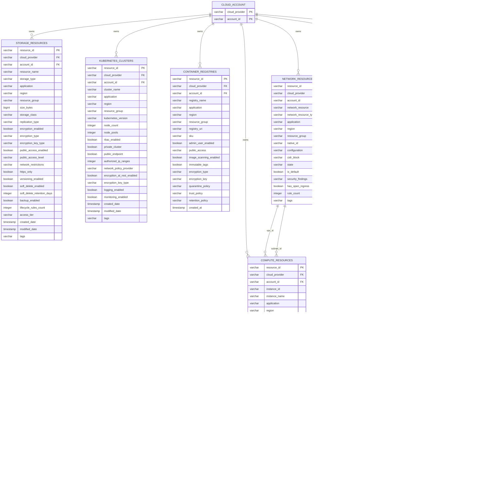

# Cloud Ops Adapter — Schema Reference

The Cloud Ops adapter is a read-only SQL view of the resource inventory of **Azure, AWS and GCP**.
Every table calls each configured provider in parallel and returns the rows of all of them
together. The `cloud_provider` column says which cloud a row came from.

This page lists every table and column, says where each value comes from in each cloud, and
describes the logical keys. Column names, order and types are those of each table class's
`getRowType`.

---

## 1. Connecting

The adapter is reachable three ways. All of them end at `CloudOpsSchemaFactory`.

| Route | How settings are passed |
|-------|-------------------------|
| `CloudOpsDriver`, URL prefix `jdbc:cloudops:` | `;`-separated `key=value` pairs, e.g. `jdbc:cloudops:aws.accessKeyId=AKIA...;aws.secretAccessKey=...;aws.accountIds=111111111111` |
| Calcite model file, `jdbc:calcite:model=/path/to/model.json` | The schema's `operand` map, with the same keys |
| [`trino-cloudops`](../../trino-cloudops/README.md) plugin | Catalog properties with dashed names (`aws.access-key-id`) |

Summary of the settings; [CONFIGURATION.md](../CONFIGURATION.md) has the detail.

| Key | Required | Env variable | Description |
|-----|----------|--------------|-------------|
| `azure.tenantId` | switches Azure on | `AZURE_TENANT_ID` | Azure AD tenant ID |
| `azure.clientId` | with Azure | `AZURE_CLIENT_ID` | Service-principal client ID |
| `azure.clientSecret` | with Azure | `AZURE_CLIENT_SECRET` | Service-principal secret |
| `azure.subscriptionIds` | with Azure | `AZURE_SUBSCRIPTION_IDS` | Subscriptions to query |
| `aws.accessKeyId` | switches AWS on | `AWS_ACCESS_KEY_ID` | Access key ID |
| `aws.secretAccessKey` | with AWS | `AWS_SECRET_ACCESS_KEY` | Secret access key |
| `aws.accountIds` | with AWS | `AWS_ACCOUNT_IDS` | Accounts to query |
| `aws.region` | no | `AWS_REGION` | One region, a comma-separated list, or `all`. Absent or `all`: every region enabled for the account |
| `aws.roleArn` | no | `AWS_ROLE_ARN` | Role to assume in each account |
| `gcp.credentialsPath` | switches GCP on | `GCP_CREDENTIALS_PATH` | Path to a service-account JSON key |
| `gcp.projectIds` | with GCP | `GCP_PROJECT_IDS` | Projects to query |
| `providers` | no | `CLOUD_OPS_PROVIDERS` | Subset of configured providers to query |

A provider that is switched on but lacks a required setting fails schema creation with a message
naming the missing settings. With no provider configured, schema creation fails with
`At least one cloud provider must be configured`.

---

## 2. Schema overview

The schema is named **`cloud`** by default and holds eight tables. Two metadata schemas,
`information_schema` and `pg_catalog`, are registered at the root for catalog introspection.

| Table | Resource kind | Azure | AWS | GCP |
|-------|---------------|:-----:|:---:|:---:|
| `compute_resources` | Virtual machines / instances | yes | yes | yes |
| `storage_resources` | Object storage, storage accounts, and on Azure disks and database storage | yes | yes | yes |
| `kubernetes_clusters` | AKS / EKS / GKE | yes | yes | yes |
| `container_registries` | ACR / ECR / Artifact Registry | yes | yes | yes |
| `network_resources` | VNets/VPCs, subnets, security groups, firewall rules | yes | yes | yes |
| `iam_resources` | Users, roles, policies, identities, service accounts | yes | yes | yes |
| `database_resources` | Managed databases and caches | yes | yes | yes |
| `compute_security_groups` | Instance-to-security-group pairs | yes | yes | no rows |

All tables are read-only. A filter on `cloud_provider` or `account_id` restricts which providers
and accounts are called; most other parts of a query run in Calcite. See
[OPTIMIZATION.md](../OPTIMIZATION.md).

A cloud that cannot be queried fails the query. It is never reported as zero rows.

**Conventions across tables**

- `cloud_provider` is `azure`, `aws` or `gcp`. It is the only column declared `NOT NULL`.
- `account_id` is the Azure subscription ID, AWS account ID or GCP project ID.
- `application` comes from the resource's tags or labels: `Application`, `application` or `app`
  on AWS and Azure (AKS clusters: `Application` or `app`), `application` or `app` on GCP. A
  resource with none of them gets `Untagged/Orphaned`.
- `resource_group` is filled for Azure only.
- `tags` is a JSON object in a `VARCHAR`.
- An empty string from a provider is returned as `NULL`.

---

## 3. Keys & relationships

> **Constraints are unenforced planner hints.** `AbstractCloudOpsTable.getStatistic()` advertises
> logical keys and foreign keys. The planner may use them and they appear in catalog
> introspection. The adapter validates nothing: it does not reject duplicates or dangling
> references.

**Primary key (declared):** `resource_id` on every table that has the column. It holds the
cloud's own identifier: an AWS ARN, an Azure resource ID, or a GCP self-link or resource name.
`compute_security_groups` has no `resource_id`; its declared key is
`(compute_resource_id, security_group_id)`.

**`native_id` on `network_resources`.** The column holds the identifier other resources use to
refer to a network object: the bare AWS id (`vpc-…`, `sg-…`, `subnet-…`), the Azure resource ID,
or the GCP self-link. `(cloud_provider, native_id)` is declared as a unique key and is the target
of the compute foreign keys. `network_resource` is a display name and is not unique.

**Foreign keys (declared):**

| From → To | Column mapping |
|-----------|----------------|
| `compute_resources` → `network_resources` | `(cloud_provider, vpc_id)` → `(cloud_provider, native_id)` |
| `compute_resources` → `network_resources` | `(cloud_provider, subnet_id)` → `(cloud_provider, native_id)` |
| `compute_resources` → `iam_resources` | `iam_role` → `resource_id` |
| `compute_security_groups` → `compute_resources` | `compute_resource_id` → `resource_id` |
| `compute_security_groups` → `network_resources` | `(cloud_provider, security_group_id)` → `(cloud_provider, native_id)` |

`compute_resources.security_groups` is a comma-separated string kept for convenience. It is not a
foreign key; use `compute_security_groups` to join instances to security groups.

There is no accounts table. `CLOUD_ACCOUNT` in the diagram stands for the subscription, account or
project every row belongs to.

---

## 4. ERD


```mermaid
erDiagram
    CLOUD_ACCOUNT {
        varchar cloud_provider PK
        varchar account_id PK
    }

    COMPUTE_RESOURCES {
        varchar resource_id PK
        varchar cloud_provider FK
        varchar account_id FK
        varchar instance_id
        varchar instance_name
        varchar application
        varchar region
        varchar availability_zone
        varchar resource_group
        varchar instance_type
        varchar state
        varchar platform
        varchar architecture
        varchar virtualization_type
        varchar public_ip
        varchar private_ip
        varchar vpc_id FK
        varchar subnet_id FK
        varchar iam_role FK
        varchar security_groups
        boolean disk_encryption_enabled
        boolean monitoring_enabled
        timestamp launch_time
    }

    STORAGE_RESOURCES {
        varchar resource_id PK
        varchar cloud_provider FK
        varchar account_id FK
        varchar resource_name
        varchar storage_type
        varchar application
        varchar region
        varchar resource_group
        bigint size_bytes
        varchar storage_class
        varchar replication_type
        boolean encryption_enabled
        varchar encryption_type
        varchar encryption_key_type
        boolean public_access_enabled
        varchar public_access_level
        varchar network_restrictions
        boolean https_only
        boolean versioning_enabled
        boolean soft_delete_enabled
        integer soft_delete_retention_days
        boolean backup_enabled
        integer lifecycle_rules_count
        varchar access_tier
        timestamp created_date
        timestamp modified_date
        varchar tags
    }

    KUBERNETES_CLUSTERS {
        varchar resource_id PK
        varchar cloud_provider FK
        varchar account_id FK
        varchar cluster_name
        varchar application
        varchar region
        varchar resource_group
        varchar kubernetes_version
        integer node_count
        integer node_pools
        boolean rbac_enabled
        boolean private_cluster
        boolean public_endpoint
        integer authorized_ip_ranges
        varchar network_policy_provider
        boolean encryption_at_rest_enabled
        varchar encryption_key_type
        boolean logging_enabled
        boolean monitoring_enabled
        timestamp created_date
        timestamp modified_date
        varchar tags
    }

    CONTAINER_REGISTRIES {
        varchar resource_id PK
        varchar cloud_provider FK
        varchar account_id FK
        varchar registry_name
        varchar application
        varchar region
        varchar resource_group
        varchar registry_uri
        varchar sku
        boolean admin_user_enabled
        varchar public_access
        boolean image_scanning_enabled
        boolean immutable_tags
        varchar encryption_type
        varchar encryption_key
        varchar quarantine_policy
        varchar trust_policy
        varchar retention_policy
        timestamp created_at
    }

    NETWORK_RESOURCES {
        varchar resource_id PK
        varchar cloud_provider FK
        varchar account_id FK
        varchar network_resource
        varchar network_resource_type
        varchar application
        varchar region
        varchar resource_group
        varchar native_id
        varchar configuration
        varchar cidr_block
        varchar state
        boolean is_default
        varchar security_findings
        boolean has_open_ingress
        integer rule_count
        varchar tags
    }

    IAM_RESOURCES {
        varchar resource_id PK
        varchar cloud_provider FK
        varchar account_id FK
        varchar iam_resource
        varchar iam_resource_type
        varchar application
        varchar region
        varchar resource_group
        varchar configuration
        varchar security_configuration
        varchar principal_type
        varchar email
        boolean is_active
        boolean mfa_enabled
        integer access_key_count
        integer active_access_keys
        timestamp create_date
        timestamp password_last_used
    }

    DATABASE_RESOURCES {
        varchar resource_id PK
        varchar cloud_provider FK
        varchar account_id FK
        varchar database_resource
        varchar database_type
        varchar application
        varchar region
        varchar resource_group
        varchar engine
        varchar engine_version
        varchar instance_class
        integer allocated_storage
        boolean multi_az
        varchar status
        boolean publicly_accessible
        boolean encrypted
        varchar encryption_key
        varchar tls_version
        integer backup_retention_days
        varchar backup_window
        timestamp create_time
    }

    COMPUTE_SECURITY_GROUPS {
        varchar cloud_provider FK
        varchar account_id
        varchar instance_id
        varchar compute_resource_id FK
        varchar security_group_id FK
    }

    CLOUD_ACCOUNT ||--o{ COMPUTE_RESOURCES : "owns"
    CLOUD_ACCOUNT ||--o{ STORAGE_RESOURCES : "owns"
    CLOUD_ACCOUNT ||--o{ KUBERNETES_CLUSTERS : "owns"
    CLOUD_ACCOUNT ||--o{ CONTAINER_REGISTRIES : "owns"
    CLOUD_ACCOUNT ||--o{ NETWORK_RESOURCES : "owns"
    CLOUD_ACCOUNT ||--o{ IAM_RESOURCES : "owns"
    CLOUD_ACCOUNT ||--o{ DATABASE_RESOURCES : "owns"

    NETWORK_RESOURCES ||--o{ COMPUTE_RESOURCES : "vpc_id"
    NETWORK_RESOURCES ||--o{ COMPUTE_RESOURCES : "subnet_id"
    IAM_RESOURCES ||--o{ COMPUTE_RESOURCES : "iam_role"
    COMPUTE_RESOURCES ||--o{ COMPUTE_SECURITY_GROUPS : "compute_resource_id"
    NETWORK_RESOURCES ||--o{ COMPUTE_SECURITY_GROUPS : "security_group_id"
```

> `CLOUD_ACCOUNT` is not a table. The other edges are the declared, unenforced foreign keys.

---

## 5. Table reference

Key column: PK = logical primary key, UK = part of a logical unique key, FK = logical foreign key.
In the per-cloud notes, "null" means the adapter returns `NULL` for that cloud by design.

### 5.1 `compute_resources`

Virtual machines: EC2 instances, Azure VMs, Compute Engine instances.

| Column | Type | Key | Description |
|--------|------|:---:|-------------|
| `cloud_provider` | VARCHAR NOT NULL | | `azure` / `aws` / `gcp` |
| `account_id` | VARCHAR | | Subscription / account / project ID |
| `instance_id` | VARCHAR | | AWS: instance ID. Azure, GCP: VM name |
| `instance_name` | VARCHAR | | AWS: `Name` tag, or the instance ID without one. Azure, GCP: VM name |
| `application` | VARCHAR | | Application tag or label |
| `region` | VARCHAR | | AWS: region. Azure: location. GCP: zone |
| `availability_zone` | VARCHAR | | AWS: availability zone. Azure: first zone of the VM. GCP: zone |
| `resource_group` | VARCHAR | | Azure resource group. AWS, GCP: null |
| `resource_id` | VARCHAR | PK | AWS: instance ARN. Azure: resource ID. GCP: self-link |
| `instance_type` | VARCHAR | | Instance type / VM size / machine type |
| `state` | VARCHAR | | AWS: instance state. Azure: power state. GCP: status |
| `platform` | VARCHAR | | AWS: platform details, e.g. `Linux/UNIX`. Azure: OS type. GCP: null |
| `architecture` | VARCHAR | | AWS: CPU architecture. GCP: CPU platform. Azure: null |
| `virtualization_type` | VARCHAR | | AWS only |
| `public_ip` | VARCHAR | | Public address, if any. Azure: of the primary network interface |
| `private_ip` | VARCHAR | | Private address. Azure, GCP: of the first network interface |
| `vpc_id` | VARCHAR | FK | AWS: VPC ID. Azure: VNet resource ID. GCP: network self-link |
| `subnet_id` | VARCHAR | FK | AWS: subnet ID. Azure: subnet resource ID. GCP: subnetwork self-link |
| `iam_role` | VARCHAR | FK | AWS: instance-profile ARN. Azure: first user-assigned identity. GCP: `projects/<project>/serviceAccounts/<email>` |
| `security_groups` | VARCHAR | | AWS: comma-separated security-group IDs. Azure: NSG of the primary network interface. GCP: comma-separated network tags |
| `disk_encryption_enabled` | BOOLEAN | | AWS: every attached EBS volume is encrypted; null for an instance with no EBS volume. Azure: OS disk has encryption settings or a disk encryption set. GCP: a disk carries its own encryption key |
| `monitoring_enabled` | BOOLEAN | | AWS: detailed monitoring. Azure: boot diagnostics. GCP: null |
| `launch_time` | TIMESTAMP | | AWS: launch time. Azure, GCP: creation time |

### 5.2 `storage_resources`

Storage. The kind is in `storage_type`:

| Cloud | `storage_type` values |
|-------|-----------------------|
| AWS | `S3 Bucket` |
| Azure | `Storage Account`, `Managed Disk`, `SQL Database`, `Cosmos DB` |
| GCP | `Cloud Storage Bucket` |

| Column | Type | Key | Description |
|--------|------|:---:|-------------|
| `cloud_provider` | VARCHAR NOT NULL | | `azure` / `aws` / `gcp` |
| `account_id` | VARCHAR | | Subscription / account / project ID |
| `resource_name` | VARCHAR | | Bucket, account, disk or database name |
| `storage_type` | VARCHAR | | See above |
| `application` | VARCHAR | | Application tag or label |
| `region` | VARCHAR | | Region / location. AWS: the bucket's region |
| `resource_group` | VARCHAR | | Azure resource group. AWS, GCP: null |
| `resource_id` | VARCHAR | PK | AWS: `arn:aws:s3:::<bucket>`. Azure: resource ID. GCP: self-link |
| `size_bytes` | BIGINT | | AWS: latest CloudWatch `BucketSizeBytes` (standard storage) of the last seven days; null without a data point. Azure: provisioned size of disks and SQL databases; null for accounts and Cosmos DB. GCP: null |
| `storage_class` | VARCHAR | | Azure: SKU, e.g. `Standard_LRS`. GCP: storage class. AWS: null (a per-object property in S3) |
| `replication_type` | VARCHAR | | AWS: `replicated (N rules)` or `none`. Azure: redundancy part of the SKU (`LRS`, `GRS`) for accounts and disks. GCP: location type |
| `encryption_enabled` | BOOLEAN | | AWS: bucket has a default-encryption configuration. Azure: per resource type. GCP: always true |
| `encryption_type` | VARCHAR | | AWS: SSE algorithm. Azure: `Customer Managed Key`, `Service Managed Key`, the account's key source, or `None`. GCP: `customer-managed` / `service-managed` |
| `encryption_key_type` | VARCHAR | | `customer-managed` or `service-managed` |
| `public_access_enabled` | BOOLEAN | | AWS: false only when all four public-access-block settings are on. Azure: the account's `allowBlobPublicAccess`; null for other types. GCP: always false; bucket IAM is not inspected |
| `public_access_level` | VARCHAR | | AWS: `blocked` / `allowed`. Azure: public network access setting. GCP: public-access-prevention setting |
| `network_restrictions` | VARCHAR | | Azure storage accounts: default action of the network rules. Otherwise null |
| `https_only` | BOOLEAN | | Azure storage accounts: `supportsHttpsTrafficOnly`. Every other row: constant true |
| `versioning_enabled` | BOOLEAN | | AWS, GCP: bucket versioning. Azure storage accounts: blob versioning; null for other types |
| `soft_delete_enabled` | BOOLEAN | | Azure storage accounts: blob soft delete. Otherwise null |
| `soft_delete_retention_days` | INTEGER | | Azure storage accounts with soft delete on. Otherwise null |
| `backup_enabled` | BOOLEAN | | AWS, Azure: null. GCP: always false |
| `lifecycle_rules_count` | INTEGER | | AWS, GCP: bucket lifecycle rules. Azure storage accounts: rules of the management policy, 0 without one; null for other types |
| `access_tier` | VARCHAR | | Azure: access tier of an account, tier of a disk. Otherwise null |
| `created_date` | TIMESTAMP | | AWS, GCP: bucket creation. Azure: accounts, disks and SQL databases |
| `modified_date` | TIMESTAMP | | GCP only |
| `tags` | VARCHAR | | JSON tags or labels |

**Azure storage accounts.** Versioning, soft delete, its retention days, and the lifecycle rule
count are not in Azure Resource Graph. The adapter reads them from Azure Resource Manager, two
requests per account: the blob service (`blobServices/default`) and the management policy
(`managementPolicies/default`). A switch that has never been turned on reads as false. An account
with no management policy has 0 lifecycle rules.

**AWS.** A per-bucket call is made only for columns the query selects. A column the query does
not select is never fetched.

### 5.3 `kubernetes_clusters`

Managed Kubernetes: AKS, EKS, GKE.

| Column | Type | Key | Description |
|--------|------|:---:|-------------|
| `cloud_provider` | VARCHAR NOT NULL | | `azure` / `aws` / `gcp` |
| `account_id` | VARCHAR | | Subscription / account / project ID |
| `cluster_name` | VARCHAR | | Cluster name |
| `application` | VARCHAR | | Application tag or label |
| `region` | VARCHAR | | Region / location |
| `resource_group` | VARCHAR | | Azure resource group. AWS, GCP: null |
| `resource_id` | VARCHAR | PK | AWS: cluster ARN. Azure: resource ID. GCP: self-link |
| `kubernetes_version` | VARCHAR | | Control-plane version |
| `node_count` | INTEGER | | AWS: sum of the desired sizes of the managed node groups. Azure: sum of the agent-pool counts. GCP: sum of the node pools' initial node counts |
| `node_pools` | INTEGER | | Number of node groups / agent pools / node pools |
| `rbac_enabled` | BOOLEAN | | Azure: `enableRBAC`. GCP: legacy ABAC is off. AWS: constant true |
| `private_cluster` | BOOLEAN | | AWS: public endpoint access is off. Azure: `enablePrivateCluster`. GCP: private nodes |
| `public_endpoint` | BOOLEAN | | AWS: `endpointPublicAccess`. Azure: not a private cluster. GCP: no private endpoint |
| `authorized_ip_ranges` | INTEGER | | Number of CIDR ranges allowed to reach the API server |
| `network_policy_provider` | VARCHAR | | Azure: network policy. GCP: network-policy provider. AWS: null |
| `encryption_at_rest_enabled` | BOOLEAN | | GCP: application-layer secrets encryption is on. AWS, Azure: constant true |
| `encryption_key_type` | VARCHAR | | AWS: `Customer Managed Key` when the cluster has a secrets-encryption configuration, else `AWS Managed Key`. Azure: `Customer Managed Key` with a disk encryption set, else `Platform Managed Key`. GCP: `customer-managed` / `service-managed` |
| `logging_enabled` | BOOLEAN | | AWS: at least one control-plane log type is enabled. Azure: Container insights (`omsagent` add-on). GCP: logging service is not `none` |
| `monitoring_enabled` | BOOLEAN | | AWS: the `amazon-cloudwatch-observability` add-on is installed. Azure: Container insights or managed Prometheus metrics. GCP: monitoring service is not `none` |
| `created_date` | TIMESTAMP | | Creation time |
| `modified_date` | TIMESTAMP | | Azure only |
| `tags` | VARCHAR | | JSON tags or labels |

Logging, monitoring, the public endpoint and the encryption key type are read from each cluster.
Three values are fixed by the service and not read: `rbac_enabled` on AWS (EKS always uses RBAC),
and `encryption_at_rest_enabled` on AWS and Azure (the service encrypts its disks).

### 5.4 `container_registries`

Azure container registries, ECR repositories (one row per repository), and Artifact Registry
repositories.

| Column | Type | Key | Description |
|--------|------|:---:|-------------|
| `cloud_provider` | VARCHAR NOT NULL | | `azure` / `aws` / `gcp` |
| `account_id` | VARCHAR | | Subscription / account / project ID |
| `registry_name` | VARCHAR | | Registry or repository name |
| `application` | VARCHAR | | Application tag or label |
| `region` | VARCHAR | | Region / location |
| `resource_group` | VARCHAR | | Azure resource group. AWS, GCP: null |
| `resource_id` | VARCHAR | PK | AWS: repository ARN. Azure: resource ID. GCP: repository resource name |
| `registry_uri` | VARCHAR | | Azure: login server. AWS: repository URI. GCP: `<location>-docker.pkg.dev/<project>/<name>` for Docker repositories, null for other formats |
| `sku` | VARCHAR | | Azure: SKU. GCP: repository format. AWS: null |
| `admin_user_enabled` | BOOLEAN | | Azure only |
| `public_access` | VARCHAR | | Azure: public network access setting. AWS: constant `Private`. GCP: null |
| `image_scanning_enabled` | BOOLEAN | | AWS: scan on push. GCP: vulnerability scanning is active. Azure: null |
| `immutable_tags` | BOOLEAN | | AWS: tag mutability is `IMMUTABLE`. GCP: Docker repositories only. Azure: null |
| `encryption_type` | VARCHAR | | AWS: `AES256` / `KMS`. Azure: `Customer Managed Key` / `Service Managed Key`. GCP: `customer-managed` / `google-managed` |
| `encryption_key` | VARCHAR | | Key reference when a customer key is used |
| `quarantine_policy` | VARCHAR | | Azure only |
| `trust_policy` | VARCHAR | | Azure only |
| `retention_policy` | VARCHAR | | Azure: retention-policy status. AWS: `Enabled` when the repository has a lifecycle policy. GCP: `Enabled` when it has a cleanup policy |
| `created_at` | TIMESTAMP | | Creation time |

### 5.5 `network_resources`

Network objects. The kind is in `network_resource_type`:

| Cloud | `network_resource_type` values |
|-------|--------------------------------|
| AWS | `VPC`, `Subnet`, `Security Group`, `Elastic IP` |
| Azure | `Virtual Network`, `Subnet`, `Network Security Group`, `Public IP`, `Load Balancer`, `Application Gateway` |
| GCP | `VPC Network`, `Subnet`, `Firewall Rule` |

| Column | Type | Key | Description |
|--------|------|:---:|-------------|
| `cloud_provider` | VARCHAR NOT NULL | UK | `azure` / `aws` / `gcp` |
| `account_id` | VARCHAR | | Subscription / account / project ID |
| `network_resource` | VARCHAR | | AWS: the resource's ID. Azure, GCP: its name |
| `network_resource_type` | VARCHAR | | See above |
| `application` | VARCHAR | | Application tag. GCP rows and Azure subnets: always `Untagged/Orphaned` |
| `region` | VARCHAR | | Region / location. GCP: subnets only |
| `resource_group` | VARCHAR | | Azure resource group. AWS, GCP: null |
| `resource_id` | VARCHAR | PK | AWS: ARN (Elastic IP: allocation ID). Azure: resource ID. GCP: self-link |
| `native_id` | VARCHAR | UK | Identifier other resources refer to; with `cloud_provider`, the unique key the foreign keys target |
| `configuration` | VARCHAR | | Free text. AWS: name and description of a security group, null otherwise. Azure: address space, rule count, allocation method or SKU. GCP: subnet mode of a network; direction, priority and network of a firewall rule |
| `cidr_block` | VARCHAR | | AWS: VPCs and subnets. Azure: first address prefix of a VNet, prefix of a subnet, the address of a public IP. GCP: range of a subnet, source ranges of an ingress rule, destination ranges of an egress rule |
| `state` | VARCHAR | | AWS: VPCs and subnets. Azure: provisioning state. GCP: `enabled` / `disabled` for firewall rules |
| `is_default` | BOOLEAN | | AWS: default VPC, default subnet of its zone. GCP: the network named `default`. Azure: null |
| `security_findings` | VARCHAR | | Azure only: `No security rules defined`, `Static public IP` |
| `has_open_ingress` | BOOLEAN | | Security groups, NSGs and firewall rules: an inbound allow rule from `0.0.0.0/0` or `::/0` (Azure: from `*`, `0.0.0.0/0`, `Internet` or `Any`). Other kinds: null |
| `rule_count` | INTEGER | | AWS: ingress rules of a security group. Azure: rules of an NSG. GCP: allowed plus denied entries of a firewall rule |
| `tags` | VARCHAR | | JSON tags. GCP: null |

### 5.6 `iam_resources`

Identities and related objects. The kind is in `iam_resource_type`:

| Cloud | `iam_resource_type` values |
|-------|----------------------------|
| AWS | `IAM User`, `IAM Role`, `IAM Policy` (customer managed), `Instance Profile` |
| Azure | `Managed Identity` (user-assigned), `Key Vault` |
| GCP | `ServiceAccount` |

| Column | Type | Key | Description |
|--------|------|:---:|-------------|
| `cloud_provider` | VARCHAR NOT NULL | | `azure` / `aws` / `gcp` |
| `account_id` | VARCHAR | | Subscription / account / project ID |
| `iam_resource` | VARCHAR | | Name. GCP: the service account's email |
| `iam_resource_type` | VARCHAR | | See above |
| `application` | VARCHAR | | Application tag. GCP rows and AWS instance profiles: always `Untagged/Orphaned` |
| `region` | VARCHAR | | AWS, GCP: `global`. Azure: location |
| `resource_group` | VARCHAR | | Azure resource group. AWS, GCP: null |
| `resource_id` | VARCHAR | PK | AWS: ARN. Azure: resource ID. GCP: `projects/<project>/serviceAccounts/<email>` |
| `configuration` | VARCHAR | | AWS: `Path: ...`. Azure: client ID of an identity, SKU of a vault. GCP: `Display: <display name>` |
| `security_configuration` | VARCHAR | | Azure key vaults: purge protection and network default action. GCP: the service account's description. AWS: null |
| `principal_type` | VARCHAR | | AWS: `User`, `Role`, `Policy`, `InstanceProfile`. Azure: `ManagedIdentity` for identities. GCP: `ServiceAccount` |
| `email` | VARCHAR | | GCP only |
| `is_active` | BOOLEAN | | GCP: the service account is not disabled. AWS: false for policies, true otherwise. Azure: constant true |
| `mfa_enabled` | BOOLEAN | | AWS users: has an MFA device. Otherwise null |
| `access_key_count` | INTEGER | | AWS users: access keys. GCP: user-managed keys. Otherwise null |
| `active_access_keys` | INTEGER | | AWS users: keys with status Active. GCP: keys neither disabled nor expired. Otherwise null |
| `create_date` | TIMESTAMP | | AWS only |
| `password_last_used` | TIMESTAMP | | AWS users only |

### 5.7 `database_resources`

Managed databases and caches. The kind is in `database_type`:

| Cloud | `database_type` values |
|-------|------------------------|
| AWS | `RDS Instance`, `RDS Cluster` (Aurora and Multi-AZ DB clusters), `DynamoDB Table`, `ElastiCache Cluster` |
| Azure | `SQL Server`, `SQL Database`, `PostgreSQL Flexible Server`, `MySQL Flexible Server`, `Cosmos DB`, `Redis Cache` |
| GCP | `Cloud SQL` |

The retired Azure single-server types for PostgreSQL, MySQL and MariaDB are not queried.

| Column | Type | Key | Description |
|--------|------|:---:|-------------|
| `cloud_provider` | VARCHAR NOT NULL | | `azure` / `aws` / `gcp` |
| `account_id` | VARCHAR | | Subscription / account / project ID |
| `database_resource` | VARCHAR | | Instance, cluster, table, server, database, account or cache name |
| `database_type` | VARCHAR | | See above |
| `application` | VARCHAR | | Application tag or label |
| `region` | VARCHAR | | Region / location |
| `resource_group` | VARCHAR | | Azure resource group. AWS, GCP: null |
| `resource_id` | VARCHAR | PK | AWS: ARN. Azure: resource ID. GCP: self-link |
| `engine` | VARCHAR | | Engine name |
| `engine_version` | VARCHAR | | Engine version |
| `instance_class` | VARCHAR | | Instance class, SKU, tier or node type |
| `allocated_storage` | INTEGER | | Allocated storage in GB |
| `multi_az` | BOOLEAN | | Spread over availability zones |
| `status` | VARCHAR | | Service-reported state |
| `publicly_accessible` | BOOLEAN | | Reachable from the public network |
| `encrypted` | BOOLEAN | | Encrypted at rest |
| `encryption_key` | VARCHAR | | Customer-managed key. Null under a service-owned key |
| `tls_version` | VARCHAR | | Minimum TLS version the service enforces |
| `backup_retention_days` | INTEGER | | Backup retention |
| `backup_window` | VARCHAR | | Daily backup window |
| `create_time` | TIMESTAMP | | Creation time |

#### AWS rows

`tls_version` is null for every AWS row: a connection negotiates TLS, and no AWS database service
reports a minimum. `resource_group` is null.

| Column | `RDS Instance` | `RDS Cluster` | `DynamoDB Table` | `ElastiCache Cluster` |
|--------|----------------|---------------|------------------|-----------------------|
| `engine` | RDS engine | RDS engine | `dynamodb` | cache engine |
| `engine_version` | yes | yes | null | yes |
| `instance_class` | DB instance class | cluster instance class; set for Multi-AZ DB clusters | null | cache node type |
| `allocated_storage` | yes | as reported for the cluster | null | null |
| `multi_az` | yes | yes | constant true | replication group's Multi-AZ setting; outside a group, true when the nodes span zones |
| `status` | instance status | cluster status | table status | cluster status |
| `publicly_accessible` | yes | set for Multi-AZ DB clusters | null | constant false |
| `encrypted` | storage encrypted | storage encrypted | constant true | at-rest encryption |
| `encryption_key` | KMS key | KMS key | KMS key ARN; null under the AWS-owned key | the replication group's KMS key; null outside a group |
| `backup_retention_days` | retention period | retention period | point-in-time-recovery window when on, 0 when off | snapshot retention limit |
| `backup_window` | preferred window | preferred window | null | snapshot window |
| `create_time` | yes | yes | yes | yes |

Nulls by design:

- **DynamoDB** is a serverless API. A table has no engine version, instance class, allocated size,
  network exposure or backup window. DynamoDB keeps every table in three zones and encrypts every
  table, so `multi_az` and `encrypted` are always true.
- **ElastiCache** has no allocated disk size. A cache is reachable only from inside its VPC, so
  `publicly_accessible` is always false.
- **Aurora clusters** carry instance class, storage and public access on their member instances,
  which appear as `RDS Instance` rows of their own.

#### Azure rows

`backup_window` is null for every Azure row: Azure schedules backups itself.

| Column | `SQL Server` | `SQL Database` | PostgreSQL / MySQL `Flexible Server` | `Cosmos DB` | `Redis Cache` |
|--------|--------------|----------------|--------------------------------------|-------------|---------------|
| `engine` | `sqlserver` | `sqlserver` | `postgres` / `mysql` | the account's enabled API types | `redis` |
| `engine_version` | server version | null | server version | API server version, where the account reports one | Redis version |
| `instance_class` | null | SKU name | SKU name | offer type | SKU name, family and capacity, e.g. `Basic_C0` |
| `allocated_storage` | null | maximum size | storage size | null | null |
| `multi_az` | null | zone redundant | high-availability mode is `ZoneRedundant` | first location is zone redundant | deployed to more than one zone |
| `status` | state | status | state | provisioning state | provisioning state |
| `publicly_accessible` | public network access | null | public network access | public network access | public network access |
| `encrypted` | null | null | constant true | constant true | null |
| `encryption_key` | key ID | null | primary key URI | Key Vault key URI | null |
| `tls_version` | minimal TLS version | null | null | minimal TLS version | minimum TLS version |
| `backup_retention_days` | null | null | backup retention days | periodic-backup retention, hours divided by 24 | null |
| `create_time` | null | creation date | created at | created at | null |

A SQL server row describes the logical server; its databases are separate `SQL Database` rows.
The system database `master` is returned like any other database.

#### GCP rows

| Column | `Cloud SQL` |
|--------|-------------|
| `engine`, `engine_version` | The two parts of `databaseVersion`: `POSTGRES_15` gives `POSTGRES` and `15` |
| `instance_class` | Tier |
| `allocated_storage` | Data disk size |
| `multi_az` | Availability type is `REGIONAL` |
| `status` | Instance state |
| `publicly_accessible` | A public IPv4 address is enabled |
| `encrypted` | Constant true |
| `encryption_key` | KMS key name; null under a Google-owned key |
| `tls_version` | `required` when the instance refuses unencrypted connections, else null |
| `backup_retention_days` | Number of retained backups. Cloud SQL retains by count, not by days |
| `backup_window` | Backup start time |
| `create_time` | Creation time |

### 5.8 `compute_security_groups`

One row per pair of instance and security group. AWS pairs an EC2 instance with each of its
security groups. Azure pairs a VM with the network security group of each of its network
interfaces. GCP returns no rows.

| Column | Type | Key | Description |
|--------|------|:---:|-------------|
| `cloud_provider` | VARCHAR NOT NULL | FK | `azure` / `aws` |
| `account_id` | VARCHAR | | Subscription / account ID |
| `instance_id` | VARCHAR | | AWS: instance ID. Azure: VM name |
| `compute_resource_id` | VARCHAR | UK, FK | `compute_resources.resource_id` of the instance |
| `security_group_id` | VARCHAR | UK, FK | `network_resources.native_id` of the group, with `cloud_provider` |

Logical unique key: `(compute_resource_id, security_group_id)`.

---

## 6. Sample queries

The names are lower-case. Quote them, or connect with `unquotedCasing=TO_LOWER` as the examples
here assume. See the [README](../README.md#identifier-case).

```sql
-- All VMs across every configured cloud
SELECT cloud_provider, account_id, instance_name, region, state, instance_type
FROM cloud.compute_resources
ORDER BY cloud_provider, region;

-- One provider: only AWS is called
SELECT instance_name, instance_type, private_ip
FROM cloud.compute_resources
WHERE cloud_provider = 'aws';

-- Databases reachable from the public network
SELECT cloud_provider, database_type, database_resource, engine, region
FROM cloud.database_resources
WHERE publicly_accessible = TRUE;

-- Azure storage accounts without versioning or soft delete
SELECT resource_name, versioning_enabled, soft_delete_enabled, lifecycle_rules_count
FROM cloud.storage_resources
WHERE cloud_provider = 'azure'
  AND storage_type = 'Storage Account'
  AND (versioning_enabled = FALSE OR soft_delete_enabled = FALSE);

-- Instances and the VPC or VNet they sit in
SELECT c.instance_name, n.network_resource, n.cidr_block, n.is_default
FROM cloud.compute_resources c
JOIN cloud.network_resources n
  ON c.cloud_provider = n.cloud_provider
 AND c.vpc_id = n.native_id;

-- Instances behind a security group that is open to the internet
SELECT c.cloud_provider, c.instance_name, n.network_resource
FROM cloud.compute_security_groups g
JOIN cloud.compute_resources c ON g.compute_resource_id = c.resource_id
JOIN cloud.network_resources n
  ON g.cloud_provider = n.cloud_provider
 AND g.security_group_id = n.native_id
WHERE n.has_open_ingress = TRUE;
```
