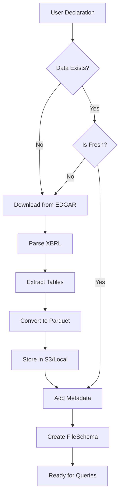

# GovData Pipeline Architecture

## The Declarative Pipeline Pattern

GovData implements a declarative data pipeline pattern where users describe *what* data they want, and the system automatically determines *how* to obtain, transform, and serve that data.

## Pipeline Stages

### Stage 1: Declaration (User → GovData)

Users declare their data requirements through configuration operands:

```json
{
  "dataSource": "sec",
  "ciks": ["AAPL", "MSFT", "GOOGL"],
  "filingTypes": ["10-K", "10-Q"],
  "startYear": 2020,
  "endYear": 2024,
  "downloadMissing": true,
  "cacheExpiry": "30d"
}
```

For other schemas, the operands vary:

**ECON Schema:**
```json
{
  "dataSource": "econ",
  "blsApiKey": "${BLS_API_KEY}",
  "fredApiKey": "${FRED_API_KEY}",
  "beaApiKey": "${BEA_API_KEY}",
  "enabledSources": ["bls", "fred", "treasury", "bea"],
  "updateFrequency": "daily"
}
```

**GEO Schema:**
```json
{
  "dataSource": "geo",
  "autoDownload": true,
  "tigerYear": 2024,
  "hudQuarter": "Q3",
  "spatialIndexing": true
}
```

These declarations use business-familiar terms:
- Company tickers (AAPL) can be used instead of CIK numbers (0000320193)
- Standard filing type names (10-K) instead of form codes
- Simple year ranges instead of complex date formats
- Clear boolean flags for features like auto-download

### Stage 2: Pipeline Orchestration (GovData)

When a connection is established, GovData:

1. **Interprets Declarations**
   ```java
   // GovDataSchemaFactory.create()
   String dataSource = operand.get("dataSource");
   switch (dataSource) {
     case "sec":
       return createSecPipeline(operand);
     case "econ":
       return createEconPipeline(operand);
     case "geo":
       return createGeoPipeline(operand);
   }
   ```

2. **Checks Pipeline State**
   ```java
   // For each declared data requirement
   if (!parquetFileExists() || isStale()) {
     triggerDataPipeline();
   }
   ```

3. **Executes Pipeline Steps**
   - Download raw data from APIs
   - Parse and validate data
   - Transform to normalized structure
   - Convert to Parquet format
   - Store in configured location
   - Add metadata enhancements

### Stage 3: Metadata Enhancement (GovData)

Before delegating to FileSchema, GovData enhances the schema with:

#### Table Comments
```java
tableMetadata.put("comment", 
  "SEC filing metadata including company details, filing dates, and incorporation state");
```

#### Column Comments
```java
columnMetadata.put("comment",
  "Central Index Key - unique identifier assigned by SEC to each reporting entity");
```

#### Foreign Key Constraints
```java
Map<String, Object> foreignKey = new HashMap<>();
foreignKey.put("columns", Arrays.asList("state_of_incorporation"));
foreignKey.put("targetTable", Arrays.asList("geo", "tiger_states"));
foreignKey.put("targetColumns", Arrays.asList("state_code"));
tableMetadata.put("foreignKeys", Arrays.asList(foreignKey));
```

### Stage 4: Schema Delegation (GovData → FileSchema)

GovData creates a FileSchema instance with:

```java
// Create FileSchema operand with enhanced metadata
Map<String, Object> fileOperand = new HashMap<>();
fileOperand.put("directory", parquetDirectory);
fileOperand.put("executionEngine", executionEngine); // DUCKDB, PARQUET, etc.
fileOperand.put("tables", enhancedTableDefinitions);

// Delegate to FileSchema
FileSchemaFactory factory = new FileSchemaFactory();
return factory.create(parentSchema, name, fileOperand);
```

### Stage 5: Query Execution (FileSchema → Engine)

FileSchema handles all query execution:

1. **Engine Selection**
   - DuckDB: For analytical queries
   - Parquet: For direct file reading
   - Linq4J: For Java-based processing
   - Arrow: For columnar operations

2. **Query Processing**
   ```
   SQL Query
     → Calcite Parser
     → Logical Plan (with FK hints)
     → Physical Plan (with partition pruning)
     → Engine Execution
     → Results
   ```

## Pipeline Components

### Data Downloaders

Each data source has specialized downloaders:

```java
public interface DataDownloader<T> {
    // Check if download needed
    boolean needsUpdate(File existingData);
    
    // Download from API
    void download(DownloadConfig config);
    
    // Parse raw data
    T parseData(File rawData);
    
    // Convert to Parquet
    void convertToParquet(T data, File outputDir);
}
```

### Storage Abstraction

The pipeline works with multiple storage backends:

```java
public interface StorageProvider {
    // Check existence
    boolean exists(String path);
    
    // Read/write operations
    InputStream openInputStream(String path);
    void writeFile(String path, byte[] content);
    
    // Directory operations
    void createDirectories(String path);
    List<String> listFiles(String path);
}
```

### Pipeline Triggers

Pipelines are triggered by:

1. **Missing Data**: File doesn't exist
2. **Stale Data**: File older than TTL
3. **Manual Refresh**: User-requested update
4. **Schema Change**: New tables/columns needed

## Pipeline Optimizations

### Incremental Updates

Only download/process what's new:

```java
// Check existing data
LocalDate lastUpdate = getLastUpdateDate();
LocalDate today = LocalDate.now();

// Only download missing days/months
for (LocalDate date = lastUpdate; date.isBefore(today); date = date.plusDays(1)) {
    downloadDataForDate(date);
}
```

### Parallel Processing

Execute pipeline stages concurrently:

```java
CompletableFuture<Void> secPipeline = CompletableFuture.runAsync(() -> 
    downloadSecData(ciks, years));
    
CompletableFuture<Void> econPipeline = CompletableFuture.runAsync(() ->
    downloadEconData(indicators));
    
CompletableFuture.allOf(secPipeline, econPipeline).join();
```

### Caching Strategy

Multi-level caching:

1. **Raw Data Cache**: Original API responses
2. **Parsed Data Cache**: Structured objects
3. **Parquet Cache**: Query-ready files
4. **Memory Cache**: Hot data in engine

## Error Handling

### Retry Logic
```java
@Retryable(maxAttempts = 3, backoff = @Backoff(delay = 1000))
public void downloadFromApi() {
    // API call with automatic retry
}
```

### Graceful Degradation
- Use cached data if API fails
- Partial results for multi-source queries
- Clear error messages to users

### Recovery Mechanisms
- Checkpoint/resume for large downloads
- Transaction logs for consistency
- Automatic cleanup of partial files

## Pipeline Monitoring

### Metrics Tracked
- API calls per second
- Data freshness (age of newest record)
- Pipeline execution time
- Storage usage
- Cache hit rates

### Health Checks
```java
public class PipelineHealthCheck {
    boolean isHealthy() {
        return apiConnectivity() &&
               storageAccessible() &&
               dataFreshness() < maxAge &&
               schemaConsistent();
    }
}
```

## Example: SEC Pipeline Flow



## Best Practices

### Declaration Design
- Use business-friendly terms
- Provide sensible defaults
- Validate early and clearly

### Pipeline Efficiency
- Check cache before downloading
- Download in parallel when possible
- Use incremental updates
- Compress data appropriately

### Error Recovery
- Log all pipeline steps
- Implement idempotent operations
- Clean up on failure
- Provide progress feedback

### Monitoring
- Track pipeline metrics
- Alert on failures
- Monitor data freshness
- Audit data access

## Summary

The GovData pipeline architecture provides:

1. **Simplicity**: Declare data needs in familiar terms
2. **Automation**: Pipeline handles all complexity
3. **Flexibility**: Multiple storage and engine options
4. **Reliability**: Robust error handling and recovery
5. **Performance**: Optimized caching and processing
6. **Transparency**: Clear monitoring and logging

This declarative approach transforms the complex task of integrating government data into a simple configuration exercise, while the pipeline ensures data is always current, properly formatted, and ready for analysis.