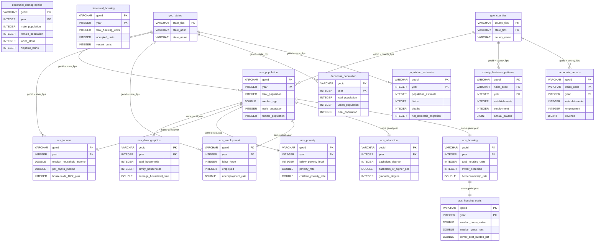

# CENSUS Schema Documentation

## Overview

The CENSUS schema provides access to U.S. Census Bureau demographic and population data including decennial census results, American Community Survey (ACS) estimates, population projections, and economic indicators. It supports comprehensive demographic analysis at national, state, county, and census tract levels.

## Entity Relationship Diagram



## Architecture Note: FileSchema Delegation

The CENSUS schema operates as a **declarative data pipeline** that:
1. **Downloads** Census data from the Census Bureau API
2. **Transforms** JSON responses to optimized Parquet format
3. **Enriches** tables with metadata, comments, and cross-schema foreign keys
4. **Delegates** actual query execution to the FileSchema adapter

## Data Sources

| Source | Tables | Description |
|--------|--------|-------------|
| ACS 5-Year | 15 tables | American Community Survey estimates |
| Decennial Census | 3 tables | 2020/2010 Census counts |
| Population Estimates | 1 table | Annual intercensal estimates |
| Economic Census | 1 table | Business establishment statistics |
| County Business Patterns | 1 table | Annual business data by county |

## Tables

### American Community Survey (ACS) Tables

The ACS provides annual estimates of demographic, social, economic, and housing characteristics. Tables are partitioned by `type` (acs) and `year`.

#### `acs_population`
Population demographics including age, sex, race, and ethnicity breakdowns.

Primary key: `(geoid, year)`
Partitions: `type=acs/year={year}`

| Column | Type | Description |
|--------|------|-------------|
| geoid | VARCHAR | Geographic identifier (state/county FIPS) |
| year | INTEGER | Survey year |
| total_population | INTEGER | Total population count |
| male_population | INTEGER | Male population |
| female_population | INTEGER | Female population |
| median_age | DOUBLE | Median age |
| under_5 | INTEGER | Population under 5 years |
| under_18 | INTEGER | Population under 18 years |
| over_65 | INTEGER | Population 65 years and over |
| white_alone | INTEGER | White alone population |
| black_alone | INTEGER | Black alone population |
| asian_alone | INTEGER | Asian alone population |
| hispanic_latino | INTEGER | Hispanic or Latino population |

#### `acs_demographics`
Detailed demographic characteristics including household composition and family structure.

Primary key: `(geoid, year)`

| Column | Type | Description |
|--------|------|-------------|
| geoid | VARCHAR | Geographic identifier |
| year | INTEGER | Survey year |
| total_households | INTEGER | Total household count |
| family_households | INTEGER | Family household count |
| married_couple_families | INTEGER | Married-couple families |
| single_parent_families | INTEGER | Single-parent families |
| average_household_size | DOUBLE | Average persons per household |
| average_family_size | DOUBLE | Average family size |

#### `acs_income`
Household and family income statistics.

Primary key: `(geoid, year)`

| Column | Type | Description |
|--------|------|-------------|
| geoid | VARCHAR | Geographic identifier |
| year | INTEGER | Survey year |
| median_household_income | DOUBLE | Median household income ($) |
| mean_household_income | DOUBLE | Mean household income ($) |
| per_capita_income | DOUBLE | Per capita income ($) |
| median_family_income | DOUBLE | Median family income ($) |
| households_under_25k | INTEGER | Households earning < $25,000 |
| households_25k_50k | INTEGER | Households earning $25,000-$49,999 |
| households_50k_75k | INTEGER | Households earning $50,000-$74,999 |
| households_75k_100k | INTEGER | Households earning $75,000-$99,999 |
| households_100k_plus | INTEGER | Households earning $100,000+ |

#### `acs_poverty`
Poverty statistics and income-to-poverty ratios.

Primary key: `(geoid, year)`

| Column | Type | Description |
|--------|------|-------------|
| geoid | VARCHAR | Geographic identifier |
| year | INTEGER | Survey year |
| population_poverty_status | INTEGER | Population with poverty status determined |
| below_poverty_level | INTEGER | Population below poverty level |
| poverty_rate | DOUBLE | Poverty rate percentage |
| children_poverty_rate | DOUBLE | Child poverty rate (under 18) |
| elderly_poverty_rate | DOUBLE | Elderly poverty rate (65+) |

#### `acs_employment`
Employment status and labor force characteristics.

Primary key: `(geoid, year)`

| Column | Type | Description |
|--------|------|-------------|
| geoid | VARCHAR | Geographic identifier |
| year | INTEGER | Survey year |
| labor_force | INTEGER | Civilian labor force |
| employed | INTEGER | Employed population |
| unemployed | INTEGER | Unemployed population |
| unemployment_rate | DOUBLE | Unemployment rate |
| labor_force_participation_rate | DOUBLE | Labor force participation rate |
| not_in_labor_force | INTEGER | Not in labor force |

#### `acs_education`
Educational attainment levels.

Primary key: `(geoid, year)`

| Column | Type | Description |
|--------|------|-------------|
| geoid | VARCHAR | Geographic identifier |
| year | INTEGER | Survey year |
| population_25_plus | INTEGER | Population 25 years and over |
| less_than_high_school | INTEGER | Less than high school diploma |
| high_school_graduate | INTEGER | High school graduate |
| some_college | INTEGER | Some college, no degree |
| associates_degree | INTEGER | Associate's degree |
| bachelors_degree | INTEGER | Bachelor's degree |
| graduate_degree | INTEGER | Graduate or professional degree |
| high_school_or_higher_pct | DOUBLE | % high school graduate or higher |
| bachelors_or_higher_pct | DOUBLE | % bachelor's degree or higher |

#### `acs_housing`
Housing characteristics and tenure.

Primary key: `(geoid, year)`

| Column | Type | Description |
|--------|------|-------------|
| geoid | VARCHAR | Geographic identifier |
| year | INTEGER | Survey year |
| total_housing_units | INTEGER | Total housing units |
| occupied_units | INTEGER | Occupied housing units |
| vacant_units | INTEGER | Vacant housing units |
| owner_occupied | INTEGER | Owner-occupied units |
| renter_occupied | INTEGER | Renter-occupied units |
| homeownership_rate | DOUBLE | Homeownership rate |
| median_rooms | DOUBLE | Median number of rooms |
| median_year_built | INTEGER | Median year structure built |

#### `acs_housing_costs`
Housing costs and affordability metrics.

Primary key: `(geoid, year)`

| Column | Type | Description |
|--------|------|-------------|
| geoid | VARCHAR | Geographic identifier |
| year | INTEGER | Survey year |
| median_home_value | DOUBLE | Median home value ($) |
| median_gross_rent | DOUBLE | Median gross rent ($) |
| median_mortgage | DOUBLE | Median monthly mortgage ($) |
| cost_burdened_owners | INTEGER | Owners spending 30%+ on housing |
| cost_burdened_renters | INTEGER | Renters spending 30%+ on housing |
| owner_cost_burden_pct | DOUBLE | % owners cost-burdened |
| renter_cost_burden_pct | DOUBLE | % renters cost-burdened |

#### `acs_commuting`
Commuting patterns and transportation.

Primary key: `(geoid, year)`

| Column | Type | Description |
|--------|------|-------------|
| geoid | VARCHAR | Geographic identifier |
| year | INTEGER | Survey year |
| workers_16_plus | INTEGER | Workers 16 years and over |
| drove_alone | INTEGER | Drove alone to work |
| carpooled | INTEGER | Carpooled to work |
| public_transit | INTEGER | Used public transportation |
| worked_from_home | INTEGER | Worked from home |
| mean_travel_time | DOUBLE | Mean travel time to work (minutes) |

#### `acs_health_insurance`
Health insurance coverage status.

Primary key: `(geoid, year)`

| Column | Type | Description |
|--------|------|-------------|
| geoid | VARCHAR | Geographic identifier |
| year | INTEGER | Survey year |
| total_population | INTEGER | Total civilian noninstitutionalized population |
| with_insurance | INTEGER | With health insurance coverage |
| without_insurance | INTEGER | Without health insurance |
| private_insurance | INTEGER | With private health insurance |
| public_insurance | INTEGER | With public coverage |
| uninsured_rate | DOUBLE | Uninsured rate |

#### `acs_language`
Language spoken at home and English proficiency.

Primary key: `(geoid, year)`

| Column | Type | Description |
|--------|------|-------------|
| geoid | VARCHAR | Geographic identifier |
| year | INTEGER | Survey year |
| population_5_plus | INTEGER | Population 5 years and over |
| english_only | INTEGER | Speak only English |
| spanish | INTEGER | Speak Spanish |
| other_indo_european | INTEGER | Other Indo-European languages |
| asian_pacific_island | INTEGER | Asian and Pacific Island languages |
| speak_english_less_than_well | INTEGER | Limited English proficiency |

#### `acs_disability`
Disability status by type.

Primary key: `(geoid, year)`

| Column | Type | Description |
|--------|------|-------------|
| geoid | VARCHAR | Geographic identifier |
| year | INTEGER | Survey year |
| total_population | INTEGER | Total civilian noninstitutionalized population |
| with_disability | INTEGER | With any disability |
| disability_rate | DOUBLE | Disability rate |
| hearing_difficulty | INTEGER | With hearing difficulty |
| vision_difficulty | INTEGER | With vision difficulty |
| cognitive_difficulty | INTEGER | With cognitive difficulty |
| ambulatory_difficulty | INTEGER | With ambulatory difficulty |

#### `acs_veterans`
Veteran status and characteristics.

Primary key: `(geoid, year)`

| Column | Type | Description |
|--------|------|-------------|
| geoid | VARCHAR | Geographic identifier |
| year | INTEGER | Survey year |
| total_veterans | INTEGER | Total veteran population |
| male_veterans | INTEGER | Male veterans |
| female_veterans | INTEGER | Female veterans |
| gulf_war_era | INTEGER | Gulf War era veterans |
| vietnam_era | INTEGER | Vietnam era veterans |
| korean_war_era | INTEGER | Korean War era veterans |
| wwii_era | INTEGER | World War II era veterans |

#### `acs_migration`
Geographic mobility and migration.

Primary key: `(geoid, year)`

| Column | Type | Description |
|--------|------|-------------|
| geoid | VARCHAR | Geographic identifier |
| year | INTEGER | Survey year |
| population_1_year_plus | INTEGER | Population 1 year and over |
| same_house | INTEGER | Same house as previous year |
| moved_within_county | INTEGER | Moved within same county |
| moved_from_different_county | INTEGER | Moved from different county |
| moved_from_different_state | INTEGER | Moved from different state |
| moved_from_abroad | INTEGER | Moved from abroad |

#### `acs_occupation`
Occupation and industry of employment.

Primary key: `(geoid, year)`

| Column | Type | Description |
|--------|------|-------------|
| geoid | VARCHAR | Geographic identifier |
| year | INTEGER | Survey year |
| employed_16_plus | INTEGER | Employed population 16+ |
| management_business | INTEGER | Management, business, science, arts |
| service_occupations | INTEGER | Service occupations |
| sales_office | INTEGER | Sales and office occupations |
| natural_resources | INTEGER | Natural resources, construction, maintenance |
| production_transport | INTEGER | Production, transportation, material moving |

### Decennial Census Tables

Official census counts conducted every 10 years.

#### `decennial_population`
Total population counts from the Decennial Census.

Primary key: `(geoid, year)`
Partitions: `type=decennial/year={year}`

| Column | Type | Description |
|--------|------|-------------|
| geoid | VARCHAR | Geographic identifier |
| year | INTEGER | Census year (2020, 2010) |
| total_population | INTEGER | Total population count |
| urban_population | INTEGER | Urban area population |
| rural_population | INTEGER | Rural area population |

#### `decennial_demographics`
Detailed demographics from Decennial Census.

Primary key: `(geoid, year)`

| Column | Type | Description |
|--------|------|-------------|
| geoid | VARCHAR | Geographic identifier |
| year | INTEGER | Census year |
| total_population | INTEGER | Total population |
| male_population | INTEGER | Male population |
| female_population | INTEGER | Female population |
| white_alone | INTEGER | White alone |
| black_alone | INTEGER | Black alone |
| asian_alone | INTEGER | Asian alone |
| hispanic_latino | INTEGER | Hispanic or Latino |
| two_or_more_races | INTEGER | Two or more races |

#### `decennial_housing`
Housing unit counts from Decennial Census.

Primary key: `(geoid, year)`

| Column | Type | Description |
|--------|------|-------------|
| geoid | VARCHAR | Geographic identifier |
| year | INTEGER | Census year |
| total_housing_units | INTEGER | Total housing units |
| occupied_units | INTEGER | Occupied units |
| vacant_units | INTEGER | Vacant units |
| owner_occupied | INTEGER | Owner-occupied |
| renter_occupied | INTEGER | Renter-occupied |

### Economic Tables

#### `economic_census`
Business establishment statistics from the Economic Census (every 5 years).

Primary key: `(geoid, naics_code, year)`

| Column | Type | Description |
|--------|------|-------------|
| geoid | VARCHAR | Geographic identifier |
| naics_code | VARCHAR | NAICS industry code |
| year | INTEGER | Census year |
| establishments | INTEGER | Number of establishments |
| employment | INTEGER | Number of employees |
| payroll | BIGINT | Annual payroll ($1,000) |
| revenue | BIGINT | Revenue/receipts ($1,000) |

#### `county_business_patterns`
Annual business data by county and industry.

Primary key: `(geoid, naics_code, year)`

| Column | Type | Description |
|--------|------|-------------|
| geoid | VARCHAR | County FIPS code |
| naics_code | VARCHAR | NAICS industry code |
| year | INTEGER | Data year |
| establishments | INTEGER | Number of establishments |
| employment | INTEGER | Number of employees |
| annual_payroll | BIGINT | Annual payroll ($1,000) |

#### `population_estimates`
Annual intercensal population estimates.

Primary key: `(geoid, year)`

| Column | Type | Description |
|--------|------|-------------|
| geoid | VARCHAR | Geographic identifier |
| year | INTEGER | Estimate year |
| population_estimate | INTEGER | Estimated population |
| births | INTEGER | Number of births |
| deaths | INTEGER | Number of deaths |
| natural_increase | INTEGER | Natural increase (births - deaths) |
| net_domestic_migration | INTEGER | Net domestic migration |
| net_international_migration | INTEGER | Net international migration |

## Cross-Schema Relationships

### To GEO Schema
- `*.geoid` → `geo.states.state_fips` (state-level data)
- `*.geoid` → `geo.counties.county_fips` (county-level data)

### From GEO Schema (Incoming)
- `geo.population_demographics.(geo_id, year)` → `census.acs_population.(geoid, year)`
- `geo.housing_characteristics.(geo_id, year)` → `census.acs_housing.(geoid, year)`
- `geo.economic_indicators.(geo_id, year)` → `census.acs_income.(geoid, year)`

### To ECON Schema
- Census employment data complements BLS employment statistics
- Income data correlates with FRED economic indicators

## Common Query Patterns

### Population Analysis
```sql
-- State population with demographics
SELECT
    s.state_name,
    p.total_population,
    p.median_age,
    p.under_18 * 100.0 / p.total_population as pct_under_18,
    p.over_65 * 100.0 / p.total_population as pct_over_65
FROM census.acs_population p
JOIN geo.states s ON p.geoid = s.state_fips
WHERE p.year = 2023
ORDER BY p.total_population DESC;
```

### Income and Poverty
```sql
-- Counties with highest poverty rates
SELECT
    c.county_name,
    s.state_abbr,
    pov.poverty_rate,
    inc.median_household_income
FROM census.acs_poverty pov
JOIN census.acs_income inc USING (geoid, year)
JOIN geo.counties c ON pov.geoid = c.county_fips
JOIN geo.states s ON c.state_fips = s.state_fips
WHERE pov.year = 2023
ORDER BY pov.poverty_rate DESC
LIMIT 20;
```

### Housing Affordability
```sql
-- Housing cost burden by state
SELECT
    s.state_name,
    h.median_home_value,
    h.median_gross_rent,
    h.renter_cost_burden_pct,
    h.owner_cost_burden_pct
FROM census.acs_housing_costs h
JOIN geo.states s ON h.geoid = s.state_fips
WHERE h.year = 2023
ORDER BY h.renter_cost_burden_pct DESC;
```

### Education and Employment
```sql
-- Educational attainment vs employment
SELECT
    s.state_name,
    e.bachelors_or_higher_pct,
    emp.unemployment_rate,
    inc.median_household_income
FROM census.acs_education e
JOIN census.acs_employment emp USING (geoid, year)
JOIN census.acs_income inc USING (geoid, year)
JOIN geo.states s ON e.geoid = s.state_fips
WHERE e.year = 2023
ORDER BY e.bachelors_or_higher_pct DESC;
```

### Population Change
```sql
-- States with largest population growth
SELECT
    s.state_name,
    pe.population_estimate,
    pe.births,
    pe.deaths,
    pe.natural_increase,
    pe.net_domestic_migration
FROM census.population_estimates pe
JOIN geo.states s ON pe.geoid = s.state_fips
WHERE pe.year = 2023
ORDER BY pe.net_domestic_migration DESC;
```

## Configuration

### Required API Key
```bash
export CENSUS_API_KEY=your_census_api_key
```

Get your free API key at: https://api.census.gov/data/key_signup.html

### Model Configuration
```json
{
  "name": "census",
  "type": "custom",
  "factory": "org.apache.calcite.adapter.govdata.GovDataSchemaFactory",
  "operand": {
    "dataSource": "census",
    "censusApiKey": "${CENSUS_API_KEY}",
    "startYear": 2019,
    "endYear": 2023,
    "geographyLevels": ["state", "county"],
    "surveys": ["acs5", "decennial", "pep"],
    "cacheDirectory": "/path/to/census-cache"
  }
}
```

## Update Schedule

| Dataset | Frequency | Release |
|---------|-----------|---------|
| ACS 5-Year | Annual | December (data from prior year) |
| ACS 1-Year | Annual | September |
| Decennial Census | Every 10 years | Year after census |
| Population Estimates | Annual | December |
| County Business Patterns | Annual | April |
| Economic Census | Every 5 years | 2+ years after census |

## Geographic Hierarchy

Census data is available at multiple geographic levels:
- **Nation**: United States total
- **State**: 50 states + DC + territories
- **County**: ~3,142 counties and county equivalents
- **Census Tract**: ~85,000 tracts (averaging 4,000 people)
- **Block Group**: ~242,000 block groups (smallest ACS geography)

The `geoid` column uses standard FIPS codes:
- State: 2 digits (e.g., "06" for California)
- County: 5 digits (e.g., "06037" for Los Angeles County)
- Tract: 11 digits (state + county + 6-digit tract)
- Block Group: 12 digits (tract + 1-digit block group)

## Special Considerations

### Margin of Error
ACS estimates include margins of error (MOE) due to sampling. For small geographies:
- Use 5-year estimates for more reliable data
- Consider combining geographies for analysis
- MOE columns available in detailed data exports

### Census vs ACS
- **Decennial Census**: 100% count, most accurate population
- **ACS**: Sample-based estimates, more detailed characteristics
- Use decennial for official population, ACS for demographics

### Variable Mapping
The CENSUS schema uses conceptual variable mappings to translate Census Bureau variable codes (like `B01001_001E`) into human-readable column names. This mapping is defined in `census-variable-mappings.json`.
