# Schema Relationships Guide

This document provides a comprehensive reference for all relationships between SEC, ECON, and GEO schemas, including foreign keys, the complete entity relationship diagram, and cross-schema query patterns.

> **Quick Navigation**
> - [Entity Relationship Diagram](#entity-relationship-diagram) - Visual overview of all tables and relationships
> - [Foreign Key Reference](#foreign-key-implementation-status) - Complete list with implementation details
> - [Query Cookbook](#query-examples-using-cross-schema-relationships) - Cross-schema query examples
> - [Temporal Relationships](#temporal-relationships-why-not-foreign-keys) - Why some relationships aren't FKs
> - [Performance Guide](#performance-considerations) - Optimization tips for cross-domain queries

## Entity Relationship Diagram

```mermaid
erDiagram
    %% ===========================
    %% SEC SCHEMA (Financial Data)
    %% ===========================

    %% SEC.filing_metadata (central reference table)
    filing_metadata {
        string cik PK
        string accession_number PK
        string filing_type
        string filing_date
        string company_name
        string ticker
        string sic_code
        string state_of_incorporation FK
        string fiscal_year_end
        string business_address
        string irs_number
    }

    %% SEC.financial_line_items
    financial_line_items {
        string cik PK_FK
        string accession_number PK_FK
        string element_id PK
        string concept
        string context_ref FK
        string unit_ref
        double numeric_value
        string period_start
        string period_end
        boolean is_instant
    }

    %% SEC.filing_contexts
    filing_contexts {
        string cik PK_FK
        string accession_number PK_FK
        string context_id PK
        string entity_identifier
        string period_start
        string period_end
        string period_instant
        string segment
        string scenario
    }

    %% SEC.mda_sections
    mda_sections {
        string cik PK_FK
        string accession_number PK_FK
        string section PK
        int paragraph_number PK
        string subsection
        string paragraph_text
        string footnote_refs
    }

    %% SEC.xbrl_relationships
    xbrl_relationships {
        string cik PK_FK
        string accession_number PK_FK
        string linkbase_type PK
        string from_concept PK
        string to_concept PK
        string arc_role
        double weight
        double order
    }

    %% SEC.insider_transactions
    insider_transactions {
        string cik PK_FK
        string accession_number PK_FK
        string reporting_person_cik PK
        string security_title PK
        string transaction_code PK
        string reporting_person_name
        boolean is_director
        boolean is_officer
        double shares_transacted
        double price_per_share
    }

    %% SEC.earnings_transcripts
    earnings_transcripts {
        string cik PK_FK
        string accession_number PK_FK
        string section_type PK
        int paragraph_number PK
        string filing_type
        string exhibit_number
        string paragraph_text
        string speaker_name
        string speaker_role
    }

    %% SEC.stock_prices
    stock_prices {
        string ticker PK
        string date PK
        string cik FK
        double open
        double high
        double low
        double close
        bigint volume
        double adjusted_close
        double split_coefficient
        double dividend
    }

    %% SEC.vectorized_chunks
    vectorized_chunks {
        string cik PK_FK
        string accession_number PK_FK
        string chunk_id PK
        int year
        string source_type
        string section
        int sequence
        string chunk_text
        string enriched_text
        array embedding
        string content_type
        string financial_concepts
    }

    %% =============================
    %% ECON SCHEMA (Economic Data)
    %% =============================

    %% ECON.employment_statistics
    employment_statistics {
        date date PK
        string series_id PK,FK
        string series_name
        decimal value
        string unit
        boolean seasonally_adjusted
        decimal percent_change_month
        decimal percent_change_year
        string category
        string subcategory
    }

    %% ECON.inflation_metrics
    inflation_metrics {
        date date PK
        string index_type PK
        string item_code PK
        string area_code PK,FK
        string item_name
        decimal index_value
        decimal percent_change_month
        decimal percent_change_year
        string area_name
        boolean seasonally_adjusted
    }

    %% ECON.wage_growth
    wage_growth {
        date date PK
        string series_id PK
        string industry_code PK
        string occupation_code PK
        string industry_name
        string occupation_name
        decimal average_hourly_earnings
        decimal average_weekly_earnings
        decimal employment_cost_index
        decimal percent_change_year
    }

    %% ECON.regional_employment
    regional_employment {
        date date PK
        string area_code PK
        string area_name
        string area_type
        string state_code FK
        decimal unemployment_rate
        bigint employment_level
        bigint labor_force
        decimal participation_rate
        decimal employment_population_ratio
    }

    %% ECON.treasury_yields
    treasury_yields {
        date date PK
        int maturity_months PK
        decimal yield_rate
        string treasury_type
        decimal bid_to_cover_ratio
        decimal high_yield
        decimal low_yield
        bigint accepted_amount
        bigint tendered_amount
    }

    %% ECON.federal_debt
    federal_debt {
        date date PK
        string debt_type PK
        decimal debt_amount
        decimal interest_rate
        string debt_category
        decimal percent_of_total
        decimal year_over_year_change
    }

    %% ECON.world_indicators
    world_indicators {
        string country_code PK
        string indicator_code PK
        int year PK
        string country_name
        string indicator_name
        decimal value
        string unit
        string region
        string income_group
    }

    %% ECON.fred_indicators
    fred_indicators {
        string series_id PK
        date date PK
        string series_title
        decimal value
        string unit
        string frequency
        boolean seasonally_adjusted
        date last_updated
    }

    %% ECON.gdp_components
    gdp_components {
        string table_id PK,FK
        int line_number PK
        int year PK
        string component_name
        decimal value
        string unit
        decimal percent_change
        decimal contribution_to_growth
        string data_source
    }

    %% ECON.regional_income
    regional_income {
        string geo_fips PK,FK
        string metric PK
        int year PK
        string geo_name
        decimal value
        string unit
        string geo_type
        decimal per_capita_value
        decimal percent_change_year
    }

    %% =============================
    %% GEO SCHEMA (Geographic Data)
    %% =============================

    %% GEO.states (bridges FIPS and 2-letter codes)
    states {
        string state_fips PK
        string state_abbr UK
        string state_name
        geometry boundary
        decimal land_area
        decimal water_area
    }

    %% GEO.counties
    counties {
        string county_fips PK
        string state_fips FK
        string county_name
        geometry boundary
        decimal land_area
        decimal water_area
    }

    %% GEO.places
    places {
        string place_fips PK
        string state_fips FK
        string place_name
        string place_type
        geometry boundary
    }

    %% GEO.zip_county_crosswalk
    zip_county_crosswalk {
        string zip PK
        string county_fips FK
        decimal res_ratio
        decimal bus_ratio
        decimal oth_ratio
        decimal tot_ratio
    }

    %% GEO.tract_zip_crosswalk
    tract_zip_crosswalk {
        string tract_fips PK
        string zip PK
        decimal res_ratio
        decimal bus_ratio
        decimal oth_ratio
        decimal tot_ratio
    }

    %% GEO.zip_cbsa_crosswalk
    zip_cbsa_crosswalk {
        string zip PK
        string cbsa_code PK,FK
        decimal res_ratio
        decimal bus_ratio
        decimal oth_ratio
        decimal tot_ratio
    }

    %% Relationships within SEC domain
    financial_line_items }o--|| filing_metadata : "belongs to filing (cik, accession_number)"
    financial_line_items }o--|| filing_contexts : "context_ref → context_id (scoped to filing)"
    filing_contexts }o--|| filing_metadata : "belongs to filing"
    mda_sections }o--|| filing_metadata : "extracted from filing"
    xbrl_relationships }o--|| filing_metadata : "from filing"
    earnings_transcripts }o--|| filing_metadata : "from 8-K filing"
    insider_transactions }o--|| filing_metadata : "Form 3/4/5 filing (cik, accession_number)"

    %% Vectorized chunks relationships (contains embeddings of text content)
    vectorized_chunks }o--|| filing_metadata : "text from filing"
    vectorized_chunks }o--|| mda_sections : "chunks MD&A text"
    vectorized_chunks }o--|| earnings_transcripts : "chunks transcript text"

    %% Relationships within ECON domain
    employment_statistics }o--|| fred_indicators : "series_id → series_id (BLS to FRED overlap)"
    inflation_metrics }o--|| regional_employment : "area_code → area_code (geographic overlap)"
    gdp_components }o--|| fred_indicators : "table_id → series_id (GDP series temporal)"

    %% Relationships within GEO domain
    counties }o--|| states : "belongs to"
    places }o--|| states : "located in"
    zip_county_crosswalk }o--|| counties : "maps to"
    tract_zip_crosswalk }o--|| counties : "within"
    zip_cbsa_crosswalk }o--|| cbsa : "metro area"

    %% Cross-schema relationships (using states.state_abbr)
    filing_metadata }o--|| states : "state_of_incorporation → state_abbr"
    regional_employment }o--|| states : "state_code → state_abbr"
    regional_income }o--|| states : "geo_fips → state_fips (2-digit state FIPS)"

    %% Other cross-schema relationships
    stock_prices }o--|| filing_metadata : "belongs to company"
    inflation_metrics }o--o{ counties : "regional inflation"

    %% Cross-domain relationships (SEC to ECON)
    financial_line_items ||--o{ employment_statistics : "correlates with economy"
    stock_prices ||--o{ inflation_metrics : "affected by inflation"
```



## Cross-Schema Relationships

### State Code Bridge Solution
The **GEO.states** table serves as the bridge between different state code formats:
- `state_fips`: FIPS codes (e.g., "06" for California) - used internally in GEO schema
- `state_abbr`: 2-letter codes (e.g., "CA") - enables FKs from SEC and ECON schemas
- Both columns exist in the same table, providing the mapping

This allows true referential integrity without requiring data transformation.

### Foreign Key Implementation Status

#### Implemented Cross-Schema FKs (in GovDataSchemaFactory)
1. **filing_metadata.state_of_incorporation → states.state_abbr**
   - Format: 2-letter state codes (e.g., "CA", "TX")
   - Implementation: `defineCrossDomainConstraintsForSec()`

2. **regional_employment.state_code → states.state_abbr**
   - Format: 2-letter state codes
   - Implementation: `defineCrossDomainConstraintsForEcon()`

3. **regional_income.geo_fips → states.state_fips**
   - Format: FIPS codes (partial - state-level only)
   - Note: Only works for 2-digit state FIPS, not 5-digit county FIPS
   - Implementation: `defineCrossDomainConstraintsForEcon()`

#### Implemented Within-Schema FKs

**SEC Schema Internal FKs (to filing_metadata)**:
1. **financial_line_items** → **filing_metadata** (cik, accession_number)
2. **filing_contexts** → **filing_metadata** (cik, accession_number)
3. **mda_sections** → **filing_metadata** (cik, accession_number)
4. **xbrl_relationships** → **filing_metadata** (cik, accession_number)
5. **insider_transactions** → **filing_metadata** (cik, accession_number)
6. **earnings_transcripts** → **filing_metadata** (cik, accession_number)
7. **vectorized_chunks** → **filing_metadata** (cik, accession_number)
8. **stock_prices** → **filing_metadata** (cik) - partial, spans multiple filings

**SEC Schema Internal FKs (context linkage)**:
9. **financial_line_items** → **filing_contexts** (cik, accession_number, context_ref) → (cik, accession_number, context_id)
   - Context IDs are only unique within a filing, so composite FK required

**ECON Schema Internal FKs**:
1. **employment_statistics.series_id** → **fred_indicators.series_id** (partial overlap)
2. **inflation_metrics.area_code** → **regional_employment.area_code** (geographic overlap)
3. **gdp_components.table_id** → **fred_indicators.series_id** (GDP series temporal)

**GEO Schema Internal FKs (Geographic Hierarchy)**:
1. **counties.state_fips** → **states.state_fips**
2. **places.state_fips** → **states.state_fips**
3. **zip_county_crosswalk.county_fips** → **counties.county_fips**
4. **tract_zip_crosswalk.tract_fips** → **census_tracts.tract_fips**
5. **zip_cbsa_crosswalk.cbsa_code** → **cbsa.cbsa_fips**
6. **census_tracts.county_fips** → **counties.county_fips**
7. **block_groups.tract_fips** → **census_tracts.tract_fips**
8. **congressional_districts.state_fips** → **states.state_fips**
9. **school_districts.state_fips** → **states.state_fips**

### Conceptual Relationships (Require data extraction/parsing)

1. **filing_metadata.business_address → zip_county_crosswalk.zip**
   - Business addresses contain ZIP codes
   - Would require parsing address field to extract ZIP
   - Enables geographic analysis of company headquarters

2. **insider_transactions → places**
   - If insider addresses were captured, could link to cities
   - Enables analysis of insider trading patterns by geography

3. **stock_prices.ticker → geographic market data**
   - Stock exchanges have geographic locations
   - Could analyze trading patterns by exchange location

## Table Categories

### SEC Tables (Partitioned by year)
- **filing_metadata**: Company and filing information (central reference table, PK: cik, accession_number)
- **financial_line_items**: XBRL financial statement data (FK to filing_metadata and filing_contexts)
- **filing_contexts**: XBRL context definitions (FK to filing_metadata)
- **mda_sections**: Management Discussion & Analysis text (FK to filing_metadata)
- **xbrl_relationships**: Concept relationships and calculations (FK to filing_metadata)
- **insider_transactions**: Forms 3, 4, 5 insider trading data (FK to filing_metadata)
- **earnings_transcripts**: 8-K earnings call transcripts (FK to filing_metadata)
- **stock_prices**: Daily stock price data (PK: ticker, date; weak FK to filing_metadata via cik)
- **vectorized_chunks**: Text embeddings for semantic search (chunks content from mda_sections and earnings_transcripts)

### GEO Tables (Static or slowly changing)
- **states**: State boundaries and metadata
- **counties**: County boundaries and metadata
- **places**: City/town data with demographics
- **census_tracts**: Census tract boundaries
- **block_groups**: Census block group boundaries
- **zctas**: ZIP Code Tabulation Areas
- **cbsa**: Core Based Statistical Areas (metros)
- **congressional_districts**: Congressional district boundaries
- **school_districts**: School district boundaries
- **zip_county_crosswalk**: ZIP to county mapping
- **tract_zip_crosswalk**: ZIP to census tract mapping
- **zip_cbsa_crosswalk**: ZIP to metro area mapping

### ECON Tables (Multi-source - Partitioned by date/series)
- **employment_statistics**: BLS national employment and unemployment data
- **inflation_metrics**: BLS CPI and PPI inflation indicators
- **wage_growth**: BLS earnings by industry and occupation
- **regional_employment**: BLS state and metro area employment statistics
- **treasury_yields**: Treasury Direct yield curves and auction data
- **federal_debt**: Treasury Direct federal debt statistics and interest rates
- **world_indicators**: World Bank international economic indicators (GDP, inflation, unemployment)
- **fred_indicators**: Federal Reserve economic time series data (800K+ indicators)
- **gdp_components**: BEA GDP components and detailed economic accounts
- **regional_income**: BEA state and regional personal income statistics

## Query Examples Using Cross-Schema Relationships

```sql
-- Companies incorporated in California with their stock performance
-- Joins across SEC and GEO schemas
SELECT
    m.company_name,
    m.state_of_incorporation,
    s.state_name,
    AVG(p.close) as avg_stock_price
FROM sec.filing_metadata m
JOIN geo.states s ON m.state_of_incorporation = s.state_abbr
JOIN sec.stock_prices p ON m.cik = p.cik
WHERE s.state_name = 'California'
GROUP BY m.company_name, m.state_of_incorporation, s.state_name;

-- Financial performance by state of incorporation
SELECT
    s.state_name,
    COUNT(DISTINCT f.cik) as company_count,
    AVG(f.value) as avg_net_income
FROM financial_line_items f
JOIN filing_metadata m ON f.cik = m.cik
    AND f.filing_type = m.filing_type
    AND f.year = m.year
JOIN geo.states s ON m.state_of_incorporation = s.state_abbr
WHERE f.concept = 'NetIncomeLoss'
GROUP BY s.state_name
ORDER BY avg_net_income DESC;

-- Geographic concentration of tech companies (using SIC codes)
SELECT
    s.state_name,
    COUNT(DISTINCT m.cik) as tech_company_count
FROM filing_metadata m
JOIN geo.states s ON m.state_of_incorporation = s.state_abbr
WHERE m.sic_code BETWEEN '7370' AND '7379' -- Computer services
GROUP BY s.state_name
ORDER BY tech_company_count DESC;

-- Company performance vs. economic indicators (SEC + ECON)
SELECT
    f.year,
    f.cik,
    m.company_name,
    f.value as revenue,
    e.value as unemployment_rate,
    i.percent_change_year as inflation_rate,
    LAG(f.value) OVER (PARTITION BY f.cik ORDER BY f.year) as prev_revenue,
    (f.value - LAG(f.value) OVER (PARTITION BY f.cik ORDER BY f.year)) /
        LAG(f.value) OVER (PARTITION BY f.cik ORDER BY f.year) * 100 as revenue_growth
FROM financial_line_items f
JOIN filing_metadata m ON f.cik = m.cik
    AND f.filing_type = m.filing_type
    AND f.year = m.year
JOIN employment_statistics e ON YEAR(e.date) = f.year
    AND e.series_id = 'UNRATE'
    AND MONTH(e.date) = 12  -- December data
JOIN inflation_metrics i ON YEAR(i.date) = f.year
    AND i.index_type = 'CPI-U'
    AND i.item_code = 'All Items'
    AND MONTH(i.date) = 12
WHERE f.concept = 'Revenues'
    AND f.filing_type = '10-K'
ORDER BY f.year, revenue_growth DESC;

-- Regional employment impact on local companies (ECON + GEO + SEC)
SELECT
    re.state_code,
    s.state_name,
    re.unemployment_rate,
    re.employment_level,
    COUNT(DISTINCT m.cik) as company_count,
    AVG(sp.close) as avg_stock_price
FROM regional_employment re
JOIN geo.states s ON re.state_code = s.state_abbr
JOIN filing_metadata m ON m.state_of_incorporation = s.state_abbr
LEFT JOIN stock_prices sp ON m.cik = sp.cik
    AND YEAR(sp.trade_date) = YEAR(re.date)
WHERE re.area_type = 'state'
    AND re.date = (SELECT MAX(date) FROM regional_employment)
GROUP BY re.state_code, s.state_name, re.unemployment_rate, re.employment_level
ORDER BY re.unemployment_rate ASC;

-- Wage growth vs. company compensation expenses (ECON + SEC)
SELECT
    w.industry_name,
    AVG(w.average_hourly_earnings) as avg_hourly_wage,
    AVG(w.percent_change_year) as wage_growth_rate,
    COUNT(DISTINCT f.cik) as companies_in_industry,
    AVG(f.value) as avg_compensation_expense
FROM wage_growth w
JOIN filing_metadata m ON m.sic_code BETWEEN '2000' AND '3999'  -- Manufacturing
JOIN financial_line_items f ON f.cik = m.cik
    AND f.concept = 'CompensationCosts'
    AND YEAR(w.date) = f.year
WHERE w.industry_code LIKE '31-33%'  -- Manufacturing NAICS
GROUP BY w.industry_name
ORDER BY wage_growth_rate DESC;
```

## Implementation Notes

### Primary Keys
- **SEC tables**: Use (cik, accession_number) as the base composite key, with additional columns for child tables:
  - filing_metadata: (cik, accession_number)
  - financial_line_items: (cik, accession_number, element_id)
  - filing_contexts: (cik, accession_number, context_id)
  - mda_sections: (cik, accession_number, section, paragraph_number)
  - insider_transactions: (cik, accession_number, reporting_person_cik, security_title, transaction_code)
  - stock_prices: (ticker, date) - not filing-based
- **GEO tables**: Use natural keys (FIPS codes, ZIP codes, etc.)
- **ECON tables**: Use composite PKs of date + series/area identifiers

### Foreign Keys
- SEC tables reference filing_metadata via (cik, accession_number)
- financial_line_items → filing_contexts uses composite FK (cik, accession_number, context_ref) since context_id is only unique within a filing
- Cross-domain FKs use stable identifiers (state_abbr, not dates)
- State codes use 2-letter abbreviations for cross-schema joins
- ECON area codes can map to both FIPS (counties) and MSA codes

### Data Freshness
- SEC data is continuously updated via RSS feeds
- GEO data is updated annually (Census/TIGER releases)
- Stock prices updated daily
- ECON data updated monthly (BLS releases on fixed schedule)
  - Employment data: First Friday of each month
  - CPI: Mid-month for prior month
  - PPI: Mid-month for prior month

### Temporal Relationships (Why Not Foreign Keys)

Temporal relationships between schemas are NOT implemented as foreign key constraints because:

1. **Different Reporting Cycles**:
   - SEC filings: Quarterly (10-Q) and Annual (10-K)
   - Economic data: Daily, Weekly, Monthly, or Quarterly
   - Stock prices: Daily trading days only
   - Dates rarely align exactly across domains

2. **Business Logic Required**:
   - "As of" date matching (e.g., find economic data closest to filing date)
   - Period overlap analysis (e.g., quarterly GDP vs fiscal quarter)
   - Lag/lead relationships (e.g., economic indicators predict future earnings)

3. **Solution: Temporal Joins**:
   ```sql
   -- Example: Join SEC filing with economic data from same quarter
   SELECT f.*, e.*
   FROM filing_metadata f
   JOIN employment_statistics e
     ON YEAR(e.date) = f.year
     AND QUARTER(e.date) = QUARTER(f.filing_date)
   WHERE e.series_id = 'UNRATE'
   ```

These relationships are better handled through:
- Application-level temporal join logic
- Window functions with date ranges
- Specialized temporal operators (if available)

### Performance Considerations
- Partition pruning critical for SEC queries
- Geographic joins benefit from spatial indexes
- Cross-domain joins should filter early to reduce data movement
- Temporal joins should use date indexes and partition pruning
