# Schema Relationships Guide

This document provides a comprehensive reference for all relationships between GovData schemas, including entity relationship diagrams and the complete table inventory.

> **Quick Navigation**
> - [Cross-Schema Overview](#cross-schema-overview-erd) - High-level view of schema interconnections
> - [SEC Schema ERD](#sec-schema-erd) - Financial filings and company data
> - [GEO Schema ERD](#geo-schema-erd) - Geographic boundaries and crosswalks
> - [ECON Schema ERD](#econ-schema-erd) - Economic indicators and statistics
> - [Census Schema ERD](#census-schema-erd) - Demographic and population data
> - [Table Inventory](#table-inventory) - Complete list of all tables

---

## Cross-Schema Overview ERD

This diagram shows the cross-schema foreign key relationships, providing a high-level view of how the four main schemas connect via the GEO schema as the central geographic reference.


**Cross-Schema Relationship Summary:**

| Source Schema | Tables with Cross-Schema FKs | Target Schema | Join Pattern |
|---------------|------------------------------|---------------|--------------|
| SEC | `filing_metadata` | GEO | `state_of_incorporation` → `states.state_abbr` |
| ECON | `state_wages`, `state_industry`, `jolts_state`, `regional_employment`, `regional_income`, `state_gdp` | GEO | `state_fips` or `geo_fips` → `states.state_fips` |
| ECON | `county_qcew`, `county_wages` | GEO | `county_fips` or `area_fips` → `counties.county_fips` |
| ECON | `metro_*` tables | ECON_REF | `metro_code` → `bls_geographies` |
| ECON | `*_income`, `*_gdp`, `state_consumption` | ECON_REF | `table_name, line_code` → `regional_linecodes` |
| Census | All 26 ACS/Decennial tables | GEO | `state` → `states.state_fips`, `county_fips` → `counties.county_fips` |

---

## SEC Schema ERD

The SEC schema contains 9 tables for financial filings and company data. All tables reference `filing_metadata` as the central fact table.


---

## GEO Schema ERD

The GEO schema contains 32 tables organized into geographic boundaries, crosswalks, and watershed hierarchies. The `states` table is the root of the geographic hierarchy.


### GEO Crosswalk Tables


### GEO Watershed Hierarchy


---

## ECON Schema ERD

The ECON schema contains 28 tables for economic indicators from BLS, BEA, Treasury, FRED, and World Bank. Tables link to GEO for geographic context and to ECON_REFERENCE for dimension lookups.


---

## Census Schema ERD

The Census schema contains 34 tables for demographic data from ACS 5-year, ACS 1-year, Decennial Census, and other Census Bureau surveys. All tables have explicit FKs to GEO schema via `state` and `county_fips` columns.

```mermaid
erDiagram
    %% ===================================
    %% CENSUS SCHEMA (34 tables, 64 FKs)
    %% ===================================

    %% GEO reference tables
    GEO_states {
        string state_fips PK
        string state_name
    }

    GEO_counties {
        string county_fips PK
        string county_name
    }

    %% ACS 5-Year Tables (sample showing FK pattern)
    acs_population {
        string geography PK
        int year PK
        string state FK
        string county_fips FK
        int total_population
    }

    acs_income {
        string geography PK
        int year PK
        string state FK
        string county_fips FK
        double median_household_income
    }

    acs_housing {
        string geography PK
        int year PK
        string state FK
        string county_fips FK
        int total_housing_units
    }

    acs_education {
        string geography PK
        int year PK
        string state FK
        string county_fips FK
    }

    acs_employment {
        string geography PK
        int year PK
        string state FK
        string county_fips FK
    }

    acs_poverty {
        string geography PK
        int year PK
        string state FK
        string county_fips FK
    }

    acs_race_ethnicity {
        string geography PK
        int year PK
        string state FK
        string county_fips FK
    }

    acs_age_distribution {
        string geography PK
        int year PK
        string state FK
        string county_fips FK
    }

    %% Decennial Census
    decennial_population {
        string geography PK
        int year PK
        string state FK
        string county_fips FK
    }

    decennial_housing {
        string geography PK
        int year PK
        string state FK
        string county_fips FK
    }

    %% ACS 1-Year (state-level only)
    acs1_population {
        string geography PK
        int year PK
        string state FK
    }

    acs1_income {
        string geography PK
        int year PK
        string state FK
    }

    %% FK relationships to GEO
    acs_population }o--|| GEO_states : "state → state_fips"
    acs_population }o--|| GEO_counties : "county_fips"
    acs_income }o--|| GEO_states : "state → state_fips"
    acs_income }o--|| GEO_counties : "county_fips"
    acs_housing }o--|| GEO_states : "state → state_fips"
    acs_housing }o--|| GEO_counties : "county_fips"
    acs_education }o--|| GEO_states : "state → state_fips"
    acs_education }o--|| GEO_counties : "county_fips"
    acs_employment }o--|| GEO_states : "state → state_fips"
    acs_employment }o--|| GEO_counties : "county_fips"
    acs_poverty }o--|| GEO_states : "state → state_fips"
    acs_poverty }o--|| GEO_counties : "county_fips"
    acs_race_ethnicity }o--|| GEO_states : "state → state_fips"
    acs_race_ethnicity }o--|| GEO_counties : "county_fips"
    acs_age_distribution }o--|| GEO_states : "state → state_fips"
    acs_age_distribution }o--|| GEO_counties : "county_fips"
    decennial_population }o--|| GEO_states : "state → state_fips"
    decennial_population }o--|| GEO_counties : "county_fips"
    decennial_housing }o--|| GEO_states : "state → state_fips"
    decennial_housing }o--|| GEO_counties : "county_fips"
    acs1_population }o--|| GEO_states : "state → state_fips"
    acs1_income }o--|| GEO_states : "state → state_fips"
```



**Note:** All 26 ACS/Decennial tables follow the same FK pattern with `state` → `geo.states.state_fips` and `county_fips` → `geo.counties.county_fips`.

---

## Table Inventory

### SEC Schema (9 tables)

| Table | Primary Key | Foreign Keys | Description |
|-------|-------------|--------------|-------------|
| `filing_metadata` | `cik, accession_number` | → `geo.states.state_abbr` | Central filing reference table |
| `financial_line_items` | `cik, accession_number, element_id` | → `filing_metadata`, → `filing_contexts` | XBRL financial facts |
| `filing_contexts` | `cik, accession_number, context_id` | → `filing_metadata` | XBRL context definitions |
| `mda_sections` | `cik, accession_number, section, paragraph_number` | → `filing_metadata` | MD&A narrative text |
| `xbrl_relationships` | `cik, accession_number, linkbase_type, from_concept, to_concept` | → `filing_metadata` | XBRL linkbase relationships |
| `insider_transactions` | `cik, accession_number, reporting_person_cik, security_title, transaction_code` | → `filing_metadata` | Form 3/4/5 insider trades |
| `earnings_transcripts` | `cik, accession_number, section_type, paragraph_number` | → `filing_metadata` | 8-K earnings content |
| `stock_prices` | `ticker, date` | → `filing_metadata.cik` | Daily OHLCV price data |
| `vectorized_chunks` | `cik, accession_number, chunk_id` | → `filing_metadata` | Semantic text chunks with embeddings |

### GEO Schema (32 tables)

| Table | Primary Key | Foreign Keys | Description |
|-------|-------------|--------------|-------------|
| `states` | `state_fips, year` | - | US state boundaries |
| `counties` | `county_fips, year` | → `states` | US county boundaries |
| `places` | `place_fips, year` | → `states` | Cities, towns, CDPs |
| `zctas` | `zcta, year` | - | ZIP Code Tabulation Areas |
| `census_tracts` | `tract_fips, year` | → `counties` | Census tract boundaries |
| `block_groups` | `block_group_fips, year` | → `census_tracts` | Census block groups |
| `cbsa` | `cbsa_fips, year` | - | Metro/micro statistical areas |
| `congressional_districts` | `cd_fips, year` | → `states` | Congressional districts |
| `school_districts` | `sd_lea, year` | → `states` | School district boundaries |
| `state_legislative_lower` | `sldl_fips, year` | → `states` | State house districts |
| `state_legislative_upper` | `sldu_fips, year` | → `states` | State senate districts |
| `county_subdivisions` | `cousub_fips, year` | → `counties` | Minor civil divisions |
| `tribal_areas` | `aiannhce, year` | - | American Indian reservations |
| `urban_areas` | `uace, year` | - | Urbanized areas |
| `pumas` | `state_fips, puma_code, year` | → `states` | Public Use Microdata Areas |
| `voting_districts` | `vtd_code, year` | → `counties` | Voting precincts |
| `zip_county_crosswalk` | `zip, county_fips, year` | → `counties` | ZIP to county mapping |
| `zip_cbsa_crosswalk` | `zip, cbsa_code, year` | → `cbsa` | ZIP to metro mapping |
| `tract_zip_crosswalk` | `tract_fips, zip, year` | → `census_tracts` | Tract to ZIP mapping |
| `zip_tract_crosswalk` | `zip, tract_fips, year` | → `census_tracts` | ZIP to tract mapping |
| `zip_cd_crosswalk` | `zip, cd_fips, year` | → `congressional_districts` | ZIP to congressional district |
| `county_zip_crosswalk` | `county_fips, zip, year` | → `counties` | County to ZIP mapping |
| `cd_zip_crosswalk` | `cd_fips, zip, year` | → `congressional_districts` | Congressional district to ZIP |
| `rural_urban_continuum` | `county_fips, year` | → `counties` | RUCC codes |
| `ruca_codes` | `tract_fips, year` | → `census_tracts` | Rural-Urban Commuting Areas |
| `gazetteer_counties` | `county_fips, year` | → `counties`, → `states` | County place names |
| `gazetteer_places` | `place_fips, year` | → `places`, → `states` | Place name gazetteer |
| `gazetteer_zctas` | `zcta, year` | → `zctas` | ZCTA gazetteer |
| `watersheds_huc2` | `huc2, year` | - | 2-digit watershed regions |
| `watersheds_huc4` | `huc4, year` | → `watersheds_huc2` | 4-digit sub-regions |
| `watersheds_huc8` | `huc8, year` | → `watersheds_huc4` | 8-digit sub-basins |
| `watersheds_huc12` | `huc12, year` | → `watersheds_huc8` | 12-digit watersheds |

### ECON Schema (28 tables)

| Table | Primary Key | Foreign Keys | Description |
|-------|-------------|--------------|-------------|
| `employment_statistics` | `type, frequency, year` | → `fred_indicators` | BLS national employment |
| `inflation_metrics` | `type, frequency, year` | → `regional_employment` | CPI/PPI inflation data |
| `regional_cpi` | `type, frequency, year` | - | Regional CPI |
| `metro_cpi` | `type, frequency, year` | → `econ_ref.bls_geographies` | Metro area CPI |
| `state_industry` | `type, frequency, year` | → `geo.states`, → `econ_ref.naics_sectors` | State industry output |
| `state_wages` | `type, frequency, year` | → `geo.states` | State wage data |
| `metro_industry` | `type, frequency, year` | → `econ_ref.bls_geographies`, → `econ_ref.naics_sectors` | Metro industry data |
| `metro_wages` | `type, frequency, year` | → `econ_ref.bls_geographies` | Metro wage data |
| `county_qcew` | `type, frequency, year` | → `geo.counties` | County employment/wages |
| `county_wages` | `type, frequency, year` | → `geo.counties`, → `geo.states` | County wage summaries |
| `jolts_regional` | `type, frequency, year` | - | JOLTS by region |
| `jolts_state` | `type, frequency, year` | → `geo.states` | JOLTS by state |
| `wage_growth` | `type, frequency, year` | - | Wage growth trends |
| `regional_employment` | `type, year, state_fips` | → `geo.states` | Regional labor statistics |
| `treasury_yields` | `type, frequency, year` | - | Treasury yield curves |
| `federal_debt` | `type, frequency, year` | - | Federal debt statistics |
| `world_indicators` | `type, frequency, year` | - | World Bank data |
| `fred_indicators` | `type, series, year` | → `econ_ref.fred_series` | FRED time series |
| `national_accounts` | `table_id, line_number, year, frequency` | → `econ_ref.nipa_tables` | NIPA tables |
| `gdp_statistics` | `type, frequency, year` | - | GDP statistics |
| `regional_income` | `geo_fips, table_name, line_code, year` | → `geo.states`, → `econ_ref.regional_linecodes` | BEA regional income |
| `state_gdp` | `geo_fips, table_name, line_code, year` | → `geo.states`, → `econ_ref.regional_linecodes` | BEA state GDP |
| `quarterly_income` | `geo_fips, table_name, line_code, year` | → `econ_ref.regional_linecodes` | BEA quarterly income |
| `quarterly_gdp` | `geo_fips, table_name, line_code, year` | → `econ_ref.regional_linecodes` | BEA quarterly GDP |
| `state_consumption` | `geo_fips, table_name, line_code, year` | → `econ_ref.regional_linecodes` | BEA state consumption |
| `trade_statistics` | `type, frequency, year` | - | Trade statistics |
| `ita_data` | `type, frequency, year` | - | International trade data |
| `industry_gdp` | `type, frequency, year` | - | GDP by industry |

### Census Schema (34 tables)

| Table | Primary Key | Foreign Keys | Description |
|-------|-------------|--------------|-------------|
| `acs_population` | `geography, year` | → `geo.states`, → `geo.counties` | ACS 5-year population |
| `acs_income` | `geography, year` | → `geo.states`, → `geo.counties` | ACS 5-year income |
| `acs_housing` | `geography, year` | → `geo.states`, → `geo.counties` | ACS 5-year housing |
| `acs_education` | `geography, year` | → `geo.states`, → `geo.counties` | ACS 5-year education |
| `acs_employment` | `geography, year` | → `geo.states`, → `geo.counties` | ACS 5-year employment |
| `acs_poverty` | `geography, year` | → `geo.states`, → `geo.counties` | ACS 5-year poverty |
| `acs_race_ethnicity` | `geography, year` | → `geo.states`, → `geo.counties` | ACS 5-year race/ethnicity |
| `acs_age_distribution` | `geography, year` | → `geo.states`, → `geo.counties` | ACS 5-year age |
| `acs_commute` | `geography, year` | → `geo.states`, → `geo.counties` | ACS 5-year commuting |
| `acs_occupation` | `geography, year` | → `geo.states`, → `geo.counties` | ACS 5-year occupation |
| `acs_language` | `geography, year` | → `geo.states`, → `geo.counties` | ACS 5-year language |
| `acs_disability` | `geography, year` | → `geo.states`, → `geo.counties` | ACS 5-year disability |
| `acs_veterans` | `geography, year` | → `geo.states`, → `geo.counties` | ACS 5-year veterans |
| `acs_migration` | `geography, year` | → `geo.states`, → `geo.counties` | ACS 5-year migration |
| `acs_industry_employment` | `geography, year` | → `geo.states`, → `geo.counties` | ACS 5-year industry emp |
| `acs_industry_wages` | `geography, year` | → `geo.states`, → `geo.counties` | ACS 5-year industry wages |
| `acs_internet` | `geography, year` | → `geo.states`, → `geo.counties` | ACS 5-year internet access |
| `acs_citizenship` | `geography, year` | → `geo.states`, → `geo.counties` | ACS 5-year citizenship |
| `acs_marital_status` | `geography, year` | → `geo.states`, → `geo.counties` | ACS 5-year marital status |
| `acs_households` | `geography, year` | → `geo.states`, → `geo.counties` | ACS 5-year household types |
| `acs_housing_tenure` | `geography, year` | → `geo.states`, → `geo.counties` | ACS 5-year housing tenure |
| `acs_income_distribution` | `geography, year` | → `geo.states`, → `geo.counties` | ACS 5-year income brackets |
| `decennial_population` | `geography, year` | → `geo.states`, → `geo.counties` | Decennial population |
| `decennial_housing` | `geography, year` | → `geo.states`, → `geo.counties` | Decennial housing |
| `population_estimates` | `geography, year` | → `geo.states`, → `geo.counties` | PEP population estimates |
| `cbp_establishments` | `geography, year, naics` | → `geo.states`, → `geo.counties` | County Business Patterns |
| `economic_census` | `geography, year, naics` | → `geo.states`, → `geo.counties` | Economic Census |
| `saipe` | `geography, year` | → `geo.states`, → `geo.counties` | Small Area Poverty Est |
| `sahie` | `geography, year` | → `geo.states`, → `geo.counties` | Small Area Health Ins Est |
| `bds` | `geography, year` | → `geo.states` | Business Dynamics Stats |
| `abs` | `geography, year` | → `geo.states` | Annual Business Survey |
| `nonemp` | `geography, year, naics` | → `geo.states`, → `geo.counties` | Nonemployer statistics |
| `acs1_population` | `geography, year` | → `geo.states` | ACS 1-year population |
| `acs1_income` | `geography, year` | → `geo.states` | ACS 1-year income |

---

## Implementation Notes

### Constraint Definition Standard

All schemas use the **schema-level** `constraints:` block pattern for consistency:

```yaml
# At end of YAML file, top-level key
constraints:
  table_name:
    primaryKey: [col1, col2]
    foreignKeys:
      - columns: [fk_col]
        targetSchema: schema_name  # optional, defaults to current schema
        targetTable: ref_table
        targetColumns: [pk_col]
        comment: Optional description
    indexes:
      - [index_col]
    unique:
      - [unique_col1, unique_col2]
```

### Primary Key Patterns
- **SEC**: Uses `(cik, accession_number)` as base composite key
- **GEO**: Uses FIPS codes with `year` for versioned boundaries
- **ECON**: Uses `(type, frequency, year)` for time series, or `(geo_fips, table_name, line_code, year)` for BEA tables
- **Census**: Uses `(geography, year)` where geography contains FIPS codes

### Foreign Key Patterns
- SEC tables reference `filing_metadata` via `(cik, accession_number)`
- GEO tables form a hierarchy: states → counties → tracts → block_groups
- ECON state tables reference `geo.states` via `state_fips` or `geo_fips`
- ECON tables reference `econ_reference` for dimension lookups
- Census tables use `state` and `county_fips` columns to join to GEO

### Geographic Identifier Standards
- **state_fips**: 2-digit (e.g., "06" for California)
- **county_fips**: 5-digit (state + county, e.g., "06037" for LA County)
- **tract_fips**: 11-digit (state + county + tract)
- **state_abbr**: 2-letter postal code (e.g., "CA")

### FK Count Summary
| Schema | Internal FKs | Cross-Schema FKs | Total |
|--------|--------------|------------------|-------|
| SEC | 9 | 1 (→ GEO) | 10 |
| GEO | 28 | 0 | 28 |
| ECON | 2 | 21 (→ GEO, → ECON_REF) | 23 |
| Census | 0 | 64 (→ GEO) | 64 |
| **Total** | 39 | 86 | **125** |
