# Schema Relationships Guide

This document provides a comprehensive reference for all relationships between GovData schemas, including entity relationship diagrams and the complete table inventory.

> **Quick Navigation**
> - [Cross-Schema Overview](#cross-schema-overview-erd) - High-level view of schema interconnections
> - [SEC Schema ERD](#sec-schema-erd) - Financial filings and company data
> - [GEO Schema ERD](#geo-schema-erd) - Geographic boundaries and crosswalks
> - [ECON Schema ERD](#econ-schema-erd) - Economic indicators and statistics
> - [Census Schema ERD](#census-schema-erd) - Demographic and population data
> - [Table Inventory](#table-inventory) - Complete list of all tables

---

## Cross-Schema Overview ERD

This diagram shows only the cross-schema foreign key relationships, providing a high-level view of how the four main schemas connect.

**Key Cross-Schema Relationships:**
| Source | Target | Join Columns | Notes |
|--------|--------|--------------|-------|
| `sec.filing_metadata` | `geo.states` | `state_of_incorporation` → `state_abbr` | Company incorporation state |
| `econ.state_wages` | `geo.states` | `state_fips` → `state_fips` | State-level wage data |
| `econ.state_personal_income` | `geo.states` | `state_fips` → `state_fips` | State income statistics |
| `econ.state_gdp` | `geo.states` | `state_fips` → `state_fips` | State GDP data |
| `census.*` | `geo.states` | `geo_id[0:2]` → `state_fips` | Implicit via FIPS prefix |

---

## SEC Schema ERD

The SEC schema contains 9 tables for financial filings and company data. All tables reference `filing_metadata` as the central fact table.

---

## GEO Schema ERD

The GEO schema contains 32 tables organized into geographic boundaries and crosswalk tables. The `states` table serves as the central reference point.

**Additional GEO Tables (not shown for clarity):**
- `state_legislative_lower`, `state_legislative_upper` - State legislature districts
- `county_subdivisions` - Minor civil divisions
- `tribal_areas` - American Indian reservations
- `urban_areas` - Urbanized areas
- `pumas` - Public Use Microdata Areas
- `voting_districts` - Voting precincts
- `gazetteer_*` - Place name gazetteers
- `watersheds_huc*` - Watershed boundaries (HUC 2/4/8/12)

---

## ECON Schema ERD

The ECON schema contains 28 tables for economic indicators from BLS, BEA, Treasury, FRED, and World Bank.

```mermaid
erDiagram
    %% ===================================
    %% ECON SCHEMA (28 tables)
    %% ===================================

    %% Employment & Labor
    employment_statistics {
        string series_id PK
        date observation_date PK
        double value
        string frequency
    }

    regional_employment {
        string area_code PK
        date observation_date PK
        double unemployment_rate
        bigint labor_force
    }

    state_wages {
        string state_fips PK
        int year PK
        string industry_code PK
        double avg_weekly_wage
        bigint employment
    }

    state_industry {
        string state_fips
        int year
        string industry_code
        double output
    }

    %% Inflation & Prices
    inflation_metrics {
        string series_id PK
        date observation_date PK
        double cpi_value
        double pct_change_yoy
    }

    regional_cpi {
        string area_code PK
        date observation_date PK
        double cpi_value
    }

    %% GDP & Income
    state_gdp {
        string state_fips FK
        int year PK
        string industry_code PK
        double gdp
    }

    state_personal_income {
        string state_fips FK
        int year PK
        double personal_income
        double per_capita_income
    }

    national_accounts {
        string table_id PK
        int line_number PK
        int year PK
        string description
        double value
    }

    %% Treasury & Federal
    treasury_yields {
        date observation_date PK
        string maturity PK
        double yield_rate
    }

    federal_debt {
        date observation_date PK
        string debt_type PK
        double amount
    }

    %% FRED Indicators
    fred_indicators {
        string series_id PK
        date observation_date PK
        double value
        string units
    }

    %% World Bank
    world_indicators {
        string country_code PK
        string indicator_code PK
        int year PK
        double value
    }

    %% GEO reference (for cross-schema)
    GEO_states {
        string state_fips PK
        string state_abbr
    }

    %% State-level FK relationships
    state_wages }o--|| GEO_states : "state_fips"
    state_gdp }o--|| GEO_states : "state_fips"
    state_personal_income }o--|| GEO_states : "state_fips"
    state_industry }o--o| GEO_states : "state_fips (implicit)"
```

**Additional ECON Tables (not shown for clarity):**
- `metro_cpi`, `metro_industry`, `metro_wages` - Metro-level statistics
- `county_qcew`, `county_wages` - County-level data
- `jolts_*` - Job Openings and Labor Turnover Survey
- `wage_growth` - Wage growth trends
- `state_quarterly_*` - Quarterly state statistics
- `state_consumption` - State consumption expenditure
- `regional_income` - Regional income data
- `ita_data` - International Trade Administration
- `gdp_statistics`, `industry_gdp` - GDP breakdowns
- `*_enriched` - Enriched views with metadata

---

## Census Schema ERD

The Census schema contains 39 tables for demographic data from ACS, Decennial Census, and other Census Bureau surveys.

```mermaid
erDiagram
    %% ===================================
    %% CENSUS SCHEMA (39 tables)
    %% ===================================

    %% American Community Survey (ACS) 5-Year
    acs_population {
        string geo_id PK
        int year PK
        int total_population
        int male_population
        int female_population
    }

    acs_income {
        string geo_id PK
        int year PK
        double median_household_income
        double per_capita_income
        double mean_household_income
    }

    acs_housing {
        string geo_id PK
        int year PK
        int total_housing_units
        int occupied_units
        int vacant_units
        double median_home_value
    }

    acs_education {
        string geo_id PK
        int year PK
        int high_school_graduates
        int bachelors_degree
        int graduate_degree
    }

    acs_employment {
        string geo_id PK
        int year PK
        int labor_force
        int employed
        int unemployed
    }

    acs_poverty {
        string geo_id PK
        int year PK
        int poverty_universe
        int below_poverty
        double poverty_rate
    }

    acs_race_ethnicity {
        string geo_id PK
        int year PK
        int white_alone
        int black_alone
        int asian_alone
        int hispanic_latino
    }

    acs_age {
        string geo_id PK
        int year PK
        int under_18
        int age_18_64
        int age_65_plus
        double median_age
    }

    %% Decennial Census
    decennial_population {
        string geo_id PK
        int year PK
        int total_population
        int urban_population
        int rural_population
    }

    decennial_housing {
        string geo_id PK
        int year PK
        int total_units
        int occupied_units
    }

    %% Population Estimates
    pep_population {
        string geo_id PK
        int year PK
        int population_estimate
        int births
        int deaths
        int net_migration
    }

    %% Business Data
    cbp_establishments {
        string geo_id PK
        int year PK
        string naics_code PK
        int establishments
        int employees
        double annual_payroll
    }

    economic_census {
        string geo_id PK
        int year PK
        string naics_code PK
        int establishments
        double sales_revenue
    }

    %% Poverty & Insurance Estimates
    saipe_poverty {
        string geo_id PK
        int year PK
        int all_ages_poverty
        int children_poverty
        double poverty_rate
    }

    sahie_insurance {
        string geo_id PK
        int year PK
        int uninsured
        double uninsured_rate
    }

    %% GEO reference (for cross-schema)
    GEO_states {
        string state_fips PK
        string state_abbr
    }

    GEO_counties {
        string county_fips PK
        string state_fips FK
    }

    %% Implicit geographic relationships (via geo_id prefix)
    acs_population }o--o| GEO_states : "geo_id[0:2] → state_fips"
    acs_income }o--o| GEO_states : "geo_id[0:2] → state_fips"
    acs_housing }o--o| GEO_counties : "geo_id → county_fips"
    decennial_population }o--o| GEO_states : "geo_id[0:2] → state_fips"
```

**Additional Census Tables (not shown for clarity):**
- `acs_commuting`, `acs_health_insurance`, `acs_language` - More ACS topics
- `acs_disability`, `acs_veterans`, `acs_migration` - Special populations
- `acs_occupation`, `acs_industry` - Employment details
- `acs_internet`, `acs_nativity` - Technology and citizenship
- `acs_marital_status`, `acs_household_type` - Household composition
- `acs_housing_tenure`, `acs_income_distribution` - Housing and income
- `acs1_*` - ACS 1-Year estimates (larger areas only)
- `bds_dynamics` - Business Dynamics Statistics
- `abs_characteristics` - Annual Business Survey
- `nonemployer_statistics` - Nonemployer businesses
- `building_permits` - Construction permits
- `qwi_employment` - Quarterly Workforce Indicators
- `lodes_workplace` - LEHD Origin-Destination data
- `trade_exports`, `trade_imports` - Trade statistics
- Summary views: `population_summary`, `income_summary`, `poverty_rate`, `education_attainment`, `unemployment_rate`

---

## Table Inventory

### SEC Schema (9 tables)

| Table | Primary Key | Foreign Keys | Description |
|-------|-------------|--------------|-------------|
| `filing_metadata` | `cik, accession_number` | → `geo.states.state_abbr` | Central filing reference table |
| `financial_line_items` | `cik, accession_number, element_id` | → `filing_metadata`, → `filing_contexts` | XBRL financial facts |
| `filing_contexts` | `cik, accession_number, context_id` | → `filing_metadata` | XBRL context definitions |
| `mda_sections` | `cik, accession_number, section, paragraph_number` | → `filing_metadata` | MD&A narrative text |
| `xbrl_relationships` | `cik, accession_number, linkbase_type, from_concept, to_concept` | → `filing_metadata` | XBRL linkbase relationships |
| `insider_transactions` | `cik, accession_number, reporting_person_cik, security_title, transaction_code` | → `filing_metadata` | Form 3/4/5 insider trades |
| `earnings_transcripts` | `cik, accession_number, section_type, paragraph_number` | → `filing_metadata` | 8-K earnings content |
| `stock_prices` | `ticker, date` | → `filing_metadata.cik` | Daily OHLCV price data |
| `vectorized_chunks` | `cik, accession_number, chunk_id` | → `filing_metadata` | Semantic text chunks with embeddings |

### GEO Schema (32 tables)

| Table | Primary Key | Foreign Keys | Description |
|-------|-------------|--------------|-------------|
| `states` | `state_fips, year` | - | US state boundaries |
| `counties` | `county_fips, year` | → `states` | US county boundaries |
| `places` | `place_fips, year` | → `states` | Cities, towns, CDPs |
| `zctas` | `zcta, year` | - | ZIP Code Tabulation Areas |
| `census_tracts` | `tract_fips, year` | → `counties` | Census tract boundaries |
| `block_groups` | `block_group_fips, year` | → `census_tracts` | Census block groups |
| `cbsa` | `cbsa_code, year` | - | Metro/micro statistical areas |
| `congressional_districts` | `cd_fips, year` | → `states` | Congressional districts |
| `school_districts` | `sd_fips, year` | → `states` | School district boundaries |
| `state_legislative_lower` | `sldl_fips, year` | → `states` | State house districts |
| `state_legislative_upper` | `sldu_fips, year` | → `states` | State senate districts |
| `county_subdivisions` | `cousub_fips, year` | → `counties` | Minor civil divisions |
| `tribal_areas` | `aiannh_fips, year` | - | American Indian reservations |
| `urban_areas` | `ua_fips, year` | - | Urbanized areas |
| `pumas` | `puma_fips, year` | → `states` | Public Use Microdata Areas |
| `voting_districts` | `vtd_fips, year` | → `counties` | Voting precincts |
| `zip_county_crosswalk` | `zip, county_fips` | → `counties` | ZIP to county mapping |
| `zip_cbsa_crosswalk` | `zip, cbsa_code` | → `cbsa` | ZIP to metro mapping |
| `tract_zip_crosswalk` | `tract_fips, zip` | → `census_tracts` | Tract to ZIP mapping |
| `zip_tract_crosswalk` | `zip, tract_fips` | → `census_tracts` | ZIP to tract mapping |
| `zip_cd_crosswalk` | `zip, cd_fips` | → `congressional_districts` | ZIP to congressional district |
| `county_zip_crosswalk` | `county_fips, zip` | → `counties` | County to ZIP mapping |
| `cd_zip_crosswalk` | `cd_fips, zip` | → `congressional_districts` | Congressional district to ZIP |
| `rural_urban_continuum` | `county_fips, year` | → `counties` | RUCC codes |
| `ruca_codes` | `tract_fips, year` | → `census_tracts` | Rural-Urban Commuting Areas |
| `gazetteer_counties` | `county_fips` | → `counties` | County place names |
| `gazetteer_places` | `place_fips` | → `places` | Place name gazetteer |
| `gazetteer_zctas` | `zcta` | → `zctas` | ZCTA gazetteer |
| `watersheds_huc2` | `huc2, year` | - | 2-digit watershed regions |
| `watersheds_huc4` | `huc4, year` | → `watersheds_huc2` | 4-digit sub-regions |
| `watersheds_huc8` | `huc8, year` | → `watersheds_huc4` | 8-digit sub-basins |
| `watersheds_huc12` | `huc12, year` | → `watersheds_huc8` | 12-digit watersheds |

### ECON Schema (28 tables)

| Table | Primary Key | Foreign Keys | Description |
|-------|-------------|--------------|-------------|
| `employment_statistics` | `series_id, date` | - | BLS national employment |
| `inflation_metrics` | `series_id, date` | - | CPI/PPI inflation data |
| `regional_cpi` | `area_code, date` | - | Regional CPI |
| `metro_cpi` | `cbsa_code, date` | - | Metro area CPI |
| `state_industry` | `state_fips, year, industry` | - | State industry output |
| `state_wages` | `state_fips, year, industry_code` | → `geo.states` | State wage data |
| `metro_industry` | `cbsa_code, year, industry` | - | Metro industry data |
| `metro_wages` | `cbsa_code, year, industry_code` | - | Metro wage data |
| `county_qcew` | `county_fips, year, industry_code` | - | County employment/wages |
| `county_wages` | `county_fips, year` | - | County wage summaries |
| `jolts_regional` | `region, date` | - | JOLTS by region |
| `jolts_state` | `state_fips, date` | - | JOLTS by state |
| `wage_growth` | `series_id, date` | - | Wage growth trends |
| `regional_employment` | `area_code, date` | - | Regional labor statistics |
| `treasury_yields` | `date, maturity` | - | Treasury yield curves |
| `federal_debt` | `date, debt_type` | - | Federal debt statistics |
| `world_indicators` | `country_code, indicator_code, year` | - | World Bank data |
| `fred_indicators` | `series_id, date` | - | FRED time series |
| `national_accounts` | `table_id, line_number, year` | - | NIPA tables |
| `state_personal_income` | `state_fips, year` | → `geo.states` | State personal income |
| `state_gdp` | `state_fips, year, industry_code` | → `geo.states` | State GDP |
| `state_quarterly_income` | `state_fips, year, quarter` | → `geo.states` | Quarterly state income |
| `state_quarterly_gdp` | `state_fips, year, quarter` | → `geo.states` | Quarterly state GDP |
| `state_consumption` | `state_fips, year` | → `geo.states` | State consumption |
| `regional_income` | `geo_fips, year` | - | Regional income data |
| `ita_data` | `series_id, date` | - | International trade data |
| `gdp_statistics` | `table_id, line, year` | - | GDP statistics |
| `industry_gdp` | `industry_code, year` | - | GDP by industry |

### Census Schema (39 tables)

| Table | Primary Key | Foreign Keys | Description |
|-------|-------------|--------------|-------------|
| `acs_population` | `geo_id, year` | - | ACS 5-year population |
| `acs_income` | `geo_id, year` | - | ACS 5-year income |
| `acs_housing` | `geo_id, year` | - | ACS 5-year housing |
| `acs_education` | `geo_id, year` | - | ACS 5-year education |
| `acs_employment` | `geo_id, year` | - | ACS 5-year employment |
| `acs_poverty` | `geo_id, year` | - | ACS 5-year poverty |
| `acs_race_ethnicity` | `geo_id, year` | - | ACS 5-year race/ethnicity |
| `acs_age` | `geo_id, year` | - | ACS 5-year age distribution |
| `acs_commuting` | `geo_id, year` | - | ACS 5-year commuting |
| `acs_health_insurance` | `geo_id, year` | - | ACS 5-year health insurance |
| `acs_language` | `geo_id, year` | - | ACS 5-year language |
| `acs_disability` | `geo_id, year` | - | ACS 5-year disability |
| `acs_veterans` | `geo_id, year` | - | ACS 5-year veterans |
| `acs_migration` | `geo_id, year` | - | ACS 5-year migration |
| `acs_occupation` | `geo_id, year` | - | ACS 5-year occupation |
| `acs_industry` | `geo_id, year` | - | ACS 5-year industry |
| `acs_internet` | `geo_id, year` | - | ACS 5-year internet access |
| `acs_nativity` | `geo_id, year` | - | ACS 5-year citizenship |
| `acs_marital_status` | `geo_id, year` | - | ACS 5-year marital status |
| `acs_household_type` | `geo_id, year` | - | ACS 5-year household types |
| `acs_housing_tenure` | `geo_id, year` | - | ACS 5-year housing tenure |
| `acs_income_distribution` | `geo_id, year` | - | ACS 5-year income brackets |
| `acs1_population` | `geo_id, year` | - | ACS 1-year population |
| `acs1_income` | `geo_id, year` | - | ACS 1-year income |
| `decennial_population` | `geo_id, year` | - | Decennial Census population |
| `decennial_housing` | `geo_id, year` | - | Decennial Census housing |
| `pep_population` | `geo_id, year` | - | Population estimates |
| `cbp_establishments` | `geo_id, year, naics_code` | - | County Business Patterns |
| `economic_census` | `geo_id, year, naics_code` | - | Economic Census |
| `saipe_poverty` | `geo_id, year` | - | Small Area Income/Poverty |
| `sahie_insurance` | `geo_id, year` | - | Small Area Health Insurance |
| `bds_dynamics` | `geo_id, year` | - | Business Dynamics Statistics |
| `abs_characteristics` | `geo_id, year` | - | Annual Business Survey |
| `nonemployer_statistics` | `geo_id, year, naics_code` | - | Nonemployer businesses |
| `building_permits` | `geo_id, year` | - | Building permits |
| `qwi_employment` | `geo_id, year, quarter` | - | Quarterly Workforce Indicators |
| `lodes_workplace` | `geo_id, year` | - | LEHD workplace data |
| `trade_exports` | `geo_id, year` | - | Export statistics |
| `trade_imports` | `geo_id, year` | - | Import statistics |

### Census Schema - Summary Views (5 views)

| View | Description |
|------|-------------|
| `population_summary` | State-level population aggregates |
| `income_summary` | State-level income aggregates |
| `poverty_rate` | State-level poverty rates |
| `education_attainment` | State-level education metrics |
| `unemployment_rate` | State-level unemployment rates |

---

## Implementation Notes

### Primary Keys
- **SEC**: Uses `(cik, accession_number)` as base composite key
- **GEO**: Uses FIPS codes with `year` for versioned boundaries
- **ECON**: Uses `(series_id, date)` or `(state_fips, year)` patterns
- **Census**: Uses `(geo_id, year)` where geo_id is a FIPS code

### Foreign Key Patterns
- SEC tables reference `filing_metadata` via `(cik, accession_number)`
- GEO tables form a hierarchy: states → counties → tracts → block_groups
- ECON state tables reference `geo.states` via `state_fips`
- Census tables use `geo_id` which can be joined to GEO tables by FIPS prefix

### Geographic Identifier Standards
- **state_fips**: 2-digit (e.g., "06" for California)
- **county_fips**: 5-digit (state + county, e.g., "06037" for LA County)
- **tract_fips**: 11-digit (state + county + tract)
- **state_abbr**: 2-letter postal code (e.g., "CA")
- **geo_id**: Variable length FIPS used in Census tables

### Data Freshness
- **SEC**: Continuously updated via EDGAR RSS feeds
- **GEO**: Annual updates (Census TIGER releases)
- **ECON**: Monthly (BLS), quarterly (BEA), or annual depending on series
- **Census**: Annual (ACS) or decennial
